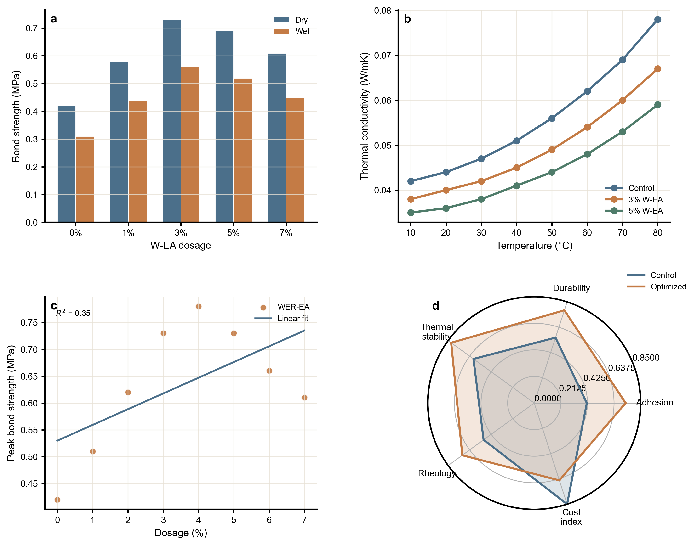

# Materials Science Skills

Materials Science Skills is a full-cycle Codex skill bundle for materials
science research. It is built for researchers who need more than isolated
prompts: they need routed workflows, evidence-grounded handoffs, release-checked
skill packaging, and outputs they can use immediately for mini-reviews,
experimental manuscripts, figures, reviewer responses, and PPTX decks.

The bundle covers civil/construction materials (asphalt, cement, durability),
polymers, metals, ceramics, functional/electronic materials, and nanomaterials.
It is strongest where materials research is usually fragile: source anchoring,
claim boundaries, paper-production routing, and reviewer-risk control.

## Why This Bundle Feels Like A System

- It routes work across research, citation, reader, writing, figure, data,
  polishing, reviewer, response, paper-to-PPT, and real PPTX generation.
- It uses standard intermediate artifacts such as `reader-package`,
  `citation_handoff.csv`, `figure_handoff.csv`, and gate reports so later
  skills do not draft from memory.
- It ships as a Codex plugin with a mirrored skill tree so the installed
  experience stays aligned with the source repo.

## Four Workflow Entry Points

| Workflow | Start With | Core Handoffs | Final Product |
|---|---|---|---|
| WER-EA mini-review | `materials-research` | citation -> reader -> writing -> figure -> reviewer | Review-ready package with screening, evidence chain, outline, figures, and risk notes |
| Experimental manuscript | `materials-research` | data -> writing -> figure -> polishing -> reviewer | Draft-ready manuscript package with figure/data boundaries |
| Revision loop | `materials-reviewer` or `materials-response` | reviewer -> weakness routing -> writing/polishing/figure/data -> response | Point-by-point response plus routed manuscript fixes |
| Paper to presentation | `materials-paper2ppt` | paper2ppt -> pptx | Chinese slide outline or real `.pptx` deck |

## Quick Start

1. Install the plugin or copy the skills locally. Full instructions live in
   [install.md](install.md).
2. Start broad work with `materials-research` when you need routing,
   paper-stage judgment, or a multi-skill plan.
3. Jump straight to the production skill when the deliverable is already clear,
   such as citation screening, reader packaging, manuscript drafting, figure
   work, response writing, or PPTX generation.

Starter prompts:

- `Help me run a WER-EA mini-review workflow from screening to figure planning.`
- `Audit this experimental manuscript for evidence gaps before I draft the discussion.`
- `Turn this paper package into a journal-club slide outline and then a real PPTX.`

## Guided Demos

- [WER-EA mini-review](docs/workflows/wer-ea-mini-review.md):
  screening -> reader package -> review outline -> figure planning
- [Experimental manuscript](docs/workflows/experimental-manuscript.md):
  manuscript audit -> data/figure tightening -> bounded discussion
- [Revision loop](docs/workflows/revision-loop.md):
  reviewer comments -> weakness routing -> proof-backed response package
- [Paper to presentation](docs/workflows/paper-to-presentation.md):
  slide-ready Markdown -> real `.pptx`

If you want the index first, open [docs/workflows/README.md](docs/workflows/README.md).

## Installation Paths

- Codex plugin:
  `codex plugin marketplace add https://github.com/cooleava1-gif/Materials-Science-Skills.git --ref main`
  then `codex plugin add materials-skills@materials-skills`
- Manual skills install:
  run `.\scripts\install.ps1` from the repository root

## Skills

| Skill | Typical product |
|---|---|
| `materials-research` | Route, topic angle, workflow package |
| `materials-reader` | Reader package, evidence-chain matrix |
| `materials-citation` | Screened citation matrix, normalized IDs |
| `materials-writing` | Manuscript section, argument chain |
| `materials-polishing` | Polished text, claim-strength audit |
| `materials-response` | Point-by-point response, rebuttal package |
| `materials-reviewer` | Simulated review, desk-reject risk report |
| `materials-paper2ppt` | Slide-ready Markdown, talk structure |
| `materials-pptx` | Real `.pptx` deck |
| `materials-figure` | Figure plan, WER-EA atlas output |
| `materials-data` | FAIR package, data availability statement |
| `materials-doe` | Experiment plan, analysis script |

## Material Coverage

Different material systems have different support depths. The bundle
currently covers **29 material systems** with four tiers:

| Tier | Count | Meaning |
|---|---|---|
| 🟢 **full** | 29 | Battle-tested (narrative + figures + reviewer criteria + examples) |
| 🟡 **partial** | 0 | Structured support (narrative + figures or reviewer criteria) |
| 🔵 **skeleton** | 0 | Routable (domain fragment + auto-generated narrative) |
| ⚪ **generic** | 0 | Scoped fallback (family-level guidance, no material-specific content) |

**Full dashboard -> [docs/coverage-dashboard.md](docs/coverage-dashboard.md)**

To check support for a specific material when working with the AI, ask:
> *"What is the coverage tier for [material system]?"*

## What You Can Open Immediately

- Human-readable skill guide:
  [docs/skills-index.md](docs/skills-index.md)
- Guided workflow demos:
  [docs/workflows/README.md](docs/workflows/README.md)
- Visual gallery:
  [docs/gallery/README.md](docs/gallery/README.md)
- Figure proof assets:
  `skills/materials-figure/assets/showcase-proof/`
- Per-skill README files:
  `skills/materials-*/README.md`

## Visual Gallery

If you want to see the system before reading every skill:

- [Materials Science Gallery](docs/gallery/README.md) collects editorial multi-panel
  boards built from bundled proof assets and reader-package style handoffs.
- The front-door boards include `wer_ea_figure_proof_board.png` and follow an
  `overview -> deviation -> relationship` narrative so the gallery reads like a
  product surface instead of a pile of screenshots.
- The gallery links back to the four guided demos so the visuals and the route
  logic stay connected.

## Outcome Showcases

If the deliverable is already clear and you want to jump straight into a result
shape:

- [Submission package](docs/showcases/submission-package.md)
- [Reviewer response](docs/showcases/reviewer-response.md)
- [FAIR data package](docs/showcases/fair-data-package.md)

The hub page is [docs/showcases/README.md](docs/showcases/README.md).

## Scope

This bundle helps structure materials research work with stronger
evidence, routing, and packaging discipline. It does not replace deep reading,
real experimental evidence, supervisor or co-author judgment, official journal
instructions, or institutional requirements.
