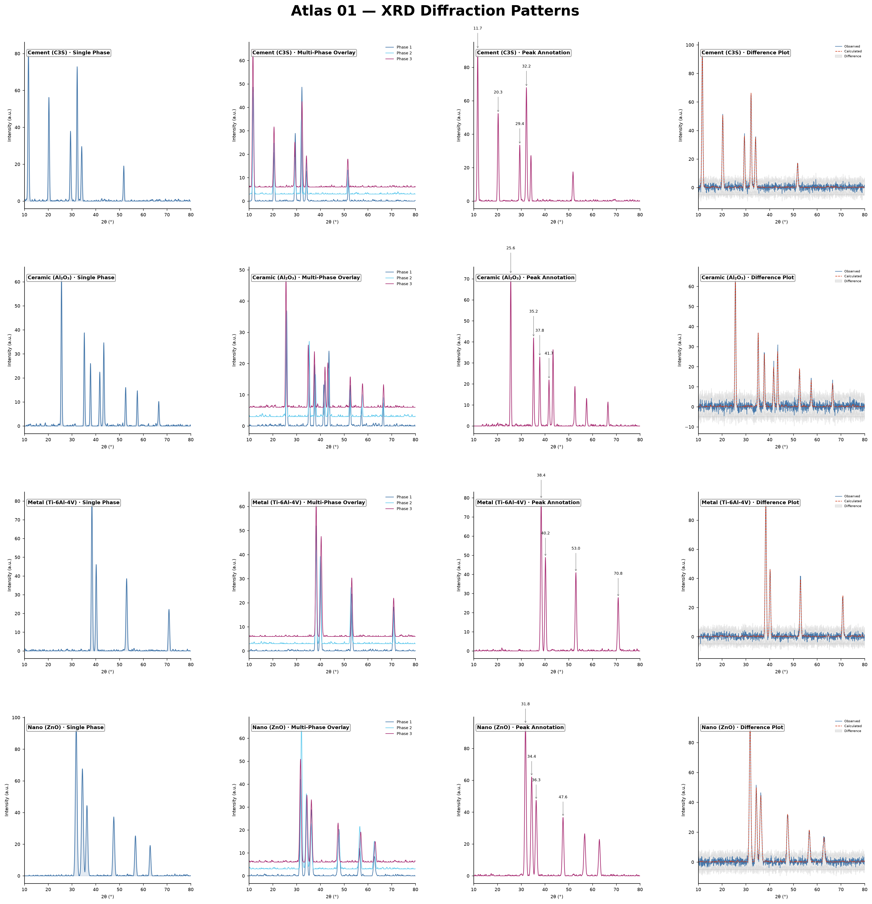
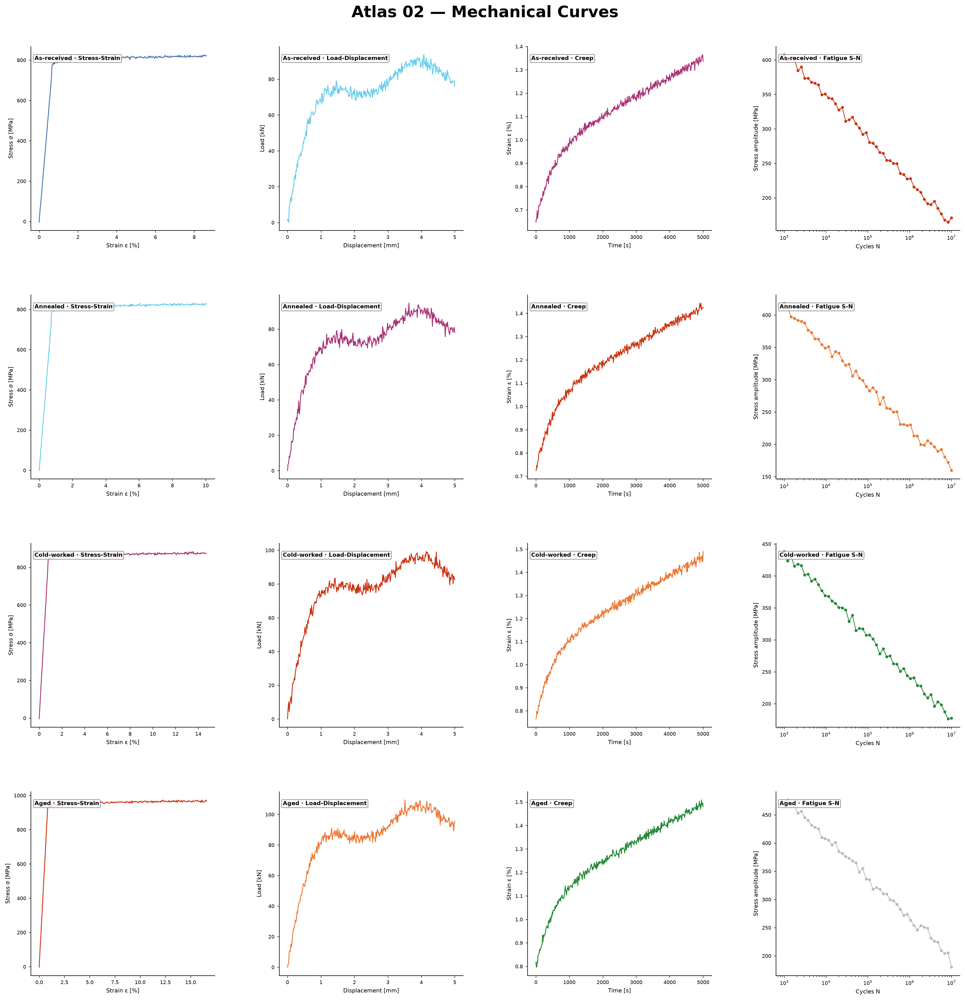
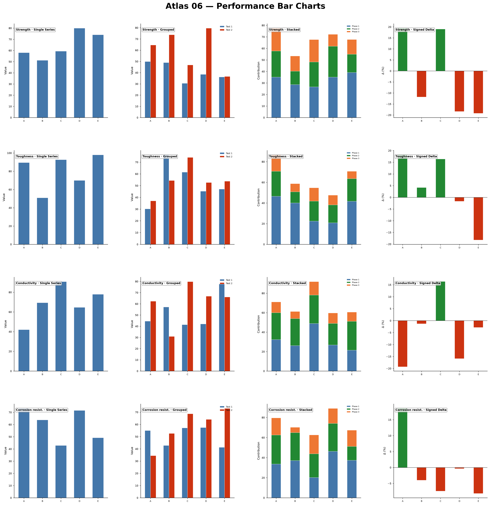
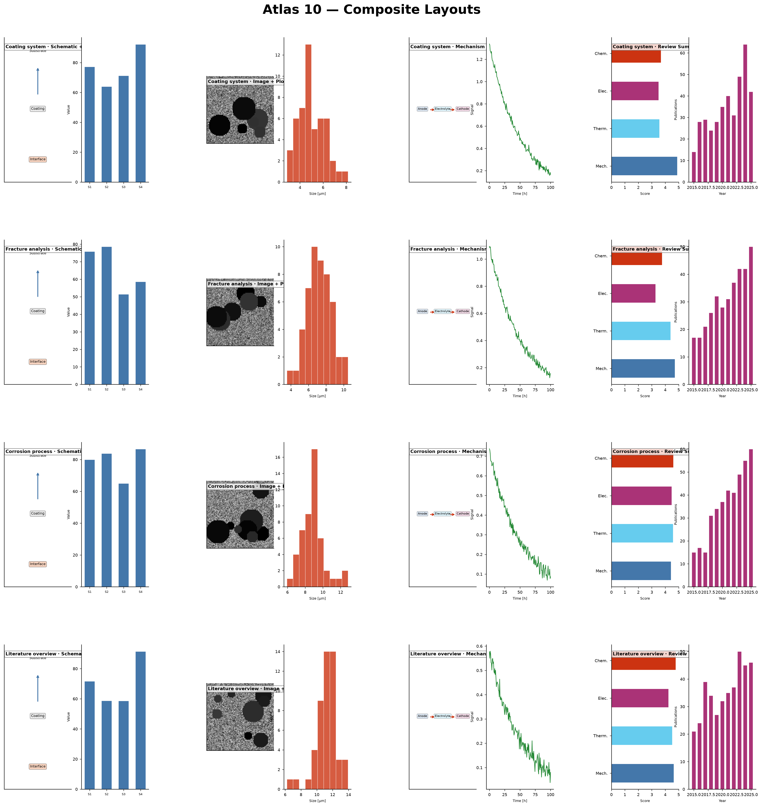
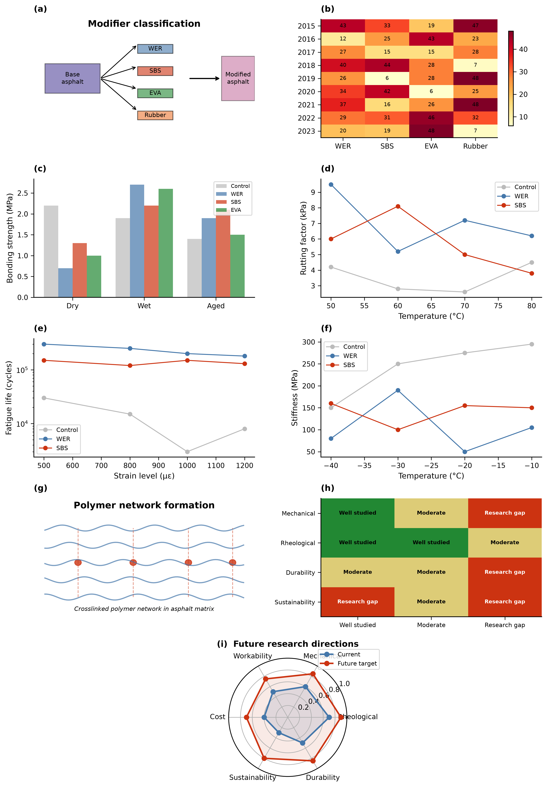
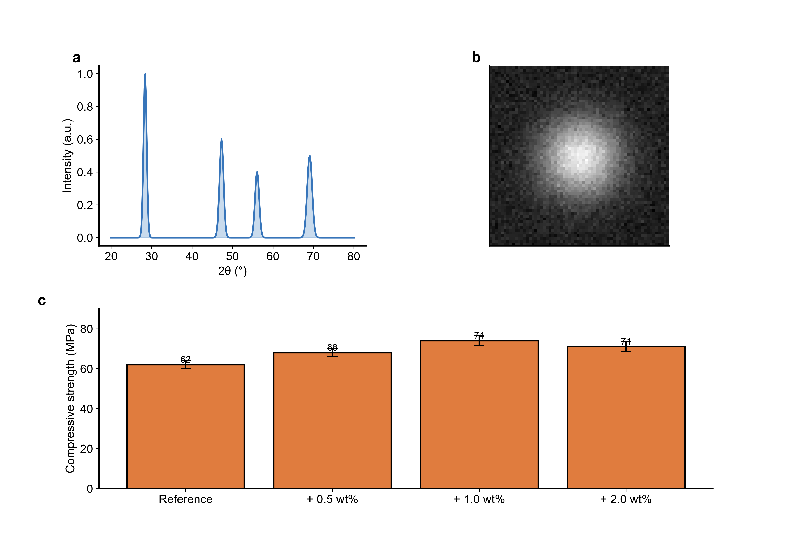

# Materials Science Skills

A full-cycle Codex skill bundle for materials science research. It connects
routing, reading, citation, writing, polishing, figure production, data
packaging, experiment design, peer review simulation, reviewer-response
drafting, slide preparation, and **paper-to-patent conversion** into one
workflow instead of leaving each step as a separate prompt.

材料科学研究的全流程 Codex 技能包。把路由、阅读、引文检索、写作、润色、
配图、数据打包、实验设计、审稿模拟、回复信撰写、演讲准备、**论文转专利**
串成一条工作流，而不是让每一步都成为孤立的提示。

The bundle ships **12 skills** covering **29 material systems** across
civil/construction, polymers, metals, ceramics, and functional/nano materials.
Each system carries a narrative arc, figure scripts, reviewer criteria, and
worked example packages where the coverage tier has reached `full`.

本技能包发布 **13 个 skills**，覆盖 **29 个材料体系**，涵盖土木、聚合物、
金属、陶瓷、功能/纳米材料。每个体系都带有叙事主线、配图脚本、审稿标准和
完整示例包（`full` 覆盖等级）。

<table>
  <tr>
    <td align="center">
      <b>Chart-Type Atlas — 21 figure families</b><br/>
      
    </td>
  </tr>
  <tr>
    <td align="center">
      <b>WER-EA Figures — dosage window, durability retention, evidence heatmap</b><br/>
      
    </td>
  </tr>
  <tr>
    <td align="center">
      <b>Cross-Material-System Figures — ceramics characterization + thermal performance</b><br/>
      
    </td>
  </tr>
</table>

## Quick Start

Start with one of the bundled workflow prompts:

```text
Help me run a WER-EA mini-review workflow from screening to figure planning.
```

For a local verification pass after installing or updating the bundle, run:

```powershell
python .\scripts\run_release_checks.py --json
```

## What the bundle does

1. **Routes** your request to the right material domain and production skill
   via a profile-first router (`materials-research`).
2. **Reads** papers into source-anchored evidence packages
   (`materials-reader`).
3. **Searches** literature through an MCP-backed academic search server that
   queries 7+ databases (`materials-citation`).
4. **Writes** manuscript sections, review outlines, and argument chains
   (`materials-writing`).
5. **Polishes** prose with claim-strength calibration and overclaim reduction
   (`materials-polishing`).
6. **Draws** journal-ready figures from CSV data and reader handoffs in
   LLM-driven workflow (`materials-figure`).
7. **Packages** data with FAIR checks and journal-ready data-availability
   statements across 9 domain schemas (`materials-data`).
8. **Designs** experiments with factorial, Taguchi, and mixture matrices
   (`materials-doe`).
9. **Reviews** drafts like a peer reviewer with 22 domain-specific criteria
   (`materials-reviewer`).
10. **Responds** to reviewer comments with point-by-point replies
    (`materials-response`).
11. **Presents** papers as verified browser-native HTML academic decks
    (`materials-html-deck`).
12. **Converts** papers into evidence-grounded Chinese invention-patent
    applications, with a civil patent knowledge base and a claim-validation
    engine (`materials-paper-to-patent`).

## Profile-first routing

The bundle follows a **profile-first routing** protocol defined in
[`_shared/core/direction-profile.md`](plugins/materials-skills/skills/_shared/core/direction-profile.md).
On first use, the router asks the user once for their current materials
research direction, saves it to a user-local file `.materials/profile.yaml`
(not tracked by git), and uses it to set defaults for `material_family` and
`domain` across all 12 skills. Later sessions skip the question and only
briefly remind the user which direction is active.

| Layer | Source | Behaviour |
|---|---|---|
| 1 | Explicit direction in the current user request | Used immediately |
| 2 | `.materials/profile.yaml` saved locally | Default fallback |
| 3 | Neutral / general materials support | Last-resort fallback |

This is what makes the bundle work like an **operating system for materials
research** instead of a set of disconnected skills.

## Installation

## Installation Paths

### 1. Codex Plugin (recommended)

This repository includes Codex plugin packaging at `plugins/materials-skills/`,
so Codex users can install the complete bundle from the plugin marketplace
instead of copying each skill folder manually.

CLI installation:

```powershell
codex plugin marketplace add https://github.com/cooleava1-gif/Materials-Science-Skills.git --ref main
codex plugin add materials-skills@materials-skills
```

Codex Desktop users can add the same repository as a custom plugin marketplace:

- Marketplace source: `https://github.com/cooleava1-gif/Materials-Science-Skills.git`
- Branch/ref: `main`
- Plugin: `materials-skills`

After installation, all 12 `materials-*` skills become available through the
plugin as a complete bundle, together with the shared support directory. If
the skills do not appear immediately, refresh the plugin page or start a new
Codex session.

### 2. Manual Skills Install

Clone the repo and run the installer:

```powershell
git clone https://github.com/cooleava1-gif/Materials-Science-Skills.git
cd Materials-Science-Skills
.\scripts\install.ps1
```

The installer copies all 12 `materials-*` skills plus `_shared` into
`$CODEX_HOME\skills` if `CODEX_HOME` is set, or into `~\.codex\skills`
otherwise. It also removes stale target directories before reinstalling so old
files do not survive an update.

If you need the manual fallback commands:

```powershell
$skillsDir = if ($env:CODEX_HOME) { Join-Path $env:CODEX_HOME "skills" } else { Join-Path $HOME ".codex\skills" }
$codexHome = Split-Path -Parent $skillsDir
New-Item -ItemType Directory -Force $skillsDir | Out-Null
Copy-Item -Recurse -Force .\plugins\materials-skills\skills\materials-* $skillsDir
Copy-Item -Recurse -Force .\plugins\materials-skills\skills\_shared $skillsDir
Copy-Item -Recurse -Force .\plugins\materials-skills\_shared $codexHome
```

### 3. Optional Academic Search MCP

If you want the local academic-search MCP, install the Python dependencies
first:

```powershell
python -m pip install -r .\plugins\materials-skills\skills\materials-citation\mcp\academic_search\requirements.txt
```

Example Codex MCP configuration:

```toml
[mcp_servers."materials-academic-search"]
command = "python"
args = ["./skills/materials-citation/mcp/academic_search/server.py"]
cwd = "plugins/materials-skills"
```

Optional environment variables:

- `OPENALEX_API_KEY`
- `SEMANTIC_SCHOLAR_API_KEY`
- `MATERIALS_CONTACT_EMAIL`
- `NCBI_API_KEY`

For the full walkthrough, see [install.md](install.md).

## Skills

## Skill index (12 skills)

| Skill | Status | Purpose | Trigger keywords |
|---|---|---|---|
| [`materials-research`](plugins/materials-skills/skills/materials-research/README.md) | Stable | Profile-first router, stage-gated plan, coverage_tier report | "materials research", "topic routing", "workflow plan" |
| [`materials-reader`](plugins/materials-skills/skills/materials-reader/README.md) | Stable | Source-anchored reader package, evidence-chain matrix | "reader package", "evidence chain", "paper notes" |
| [`materials-citation`](plugins/materials-skills/skills/materials-citation/README.md) | Stable | MCP-backed search, citation matrix, reference-gap audit | "citation matrix", "literature screening", "reference gap" |
| [`materials-writing`](plugins/materials-skills/skills/materials-writing/README.md) | Stable | 6-axis manuscript drafting, 42 narrative references, section arcs | "manuscript draft", "review outline", "argument chain" |
| [`materials-polishing`](plugins/materials-skills/skills/materials-polishing/README.md) | Stable | Claim-strength audit, overclaim reduction, journal-tone tightening | "polish", "claim strength", "academic tone" |
| [`materials-figure`](plugins/materials-skills/skills/materials-figure/README.md) | Stable | LLM-driven figure contract + plot, representative atlas/gallery samples | "figure", "publication plot", "mechanism map" |
| [`materials-data`](plugins/materials-skills/skills/materials-data/README.md) | Stable | FAIR package, 9 domain schemas, data availability statement | "FAIR package", "data availability", "dataset" |
| [`materials-doe`](plugins/materials-skills/skills/materials-doe/README.md) | Stable | Factorial / Taguchi / mixture matrices, methods paragraph | "DOE", "experiment design", "orthogonal array" |
| [`materials-reviewer`](plugins/materials-skills/skills/materials-reviewer/README.md) | Stable | 5-axis peer review, 22 domain criteria, desk-reject risk | "peer review", "desk-reject risk", "reviewer report" |
| [`materials-response`](plugins/materials-skills/skills/materials-response/README.md) | Beta | Point-by-point response, rebuttal package, action mapping | "response letter", "rebuttal", "reviewer comment" |
| [`materials-html-deck`](plugins/materials-skills/skills/materials-html-deck/README.md) | Beta | Browser-native HTML academic deck generation with strict Playwright QA | "html deck", "academic deck", "slide deck", "paper to slides", "journal club" |
| [`materials-paper-to-patent`](plugins/materials-skills/skills/materials-paper-to-patent/README.md) | Beta | Chinese invention-patent application, civil patent KB, claim validator | "patent", "claim", "invention disclosure" |

> **Status legend:** `Stable` = documented, installable, and covered by the public lightweight release gate. `Beta` = functional and documented, but still accumulating domain coverage depth.

---

## materials-figure — the flagship

**What it does** — Generates journal-ready multi-panel figures for materials
manuscripts: mechanism maps, evidence heatmaps, dosage-window plots,
characterization panels, review figures, and full figure packages with source
data, caption boundaries, and export QA. Python-only backend, SVG-first
output, with PNG/PDF/TIFF export bundles.

**LLM-driven figure creation** — This is no longer a fixed generator-script
pipeline. The skill validates a figure contract and source-data anchor first;
then the LLM writes `plot.py` directly from the contract, data, chart-atlas
reference, legend rules, and reviewer-risk notes.

```text
figure_contract.md -> source_data.csv -> LLM writes plot.py
  -> figure.svg / figure.pdf / figure.png / figure.tiff
  -> caption.md + qa_report.md + asset_manifest.md
```

**Visual assets shipped with the skill** - representative visual samples are
kept in the public repository so the package stays readable and installable.
The full internal regression suite and large generated figure corpus are not
part of the public GitHub delivery.

| Layer | Public boundary | Purpose |
|---|---|---|
| `assets/chart-atlas/` | representative PNG atlas boards | Chart-type selection examples |
| `assets/gallery/` | representative composite figures | Submission-grade multi-panel references |
| `assets/showcase-proof/` | WER-EA proof board | End-to-end visual proof for the flagship workflow |

|  |  |  |
|---|---|---|
|  |  |  |


**Figure package structure** — Every serious output is delivered as a figure
package, not a loose image:

```text
figure-package/
  figure_contract.md
  source_data.csv
  plot.py
  figure.svg
  figure.pdf
  figure.png
  figure.tiff
  caption.md
  qa_report.md
  asset_manifest.md
```

**Key rules enforced**

- Python-only plotting backend; no silent fallback to another stack.
- Figure contract written before plotting: core conclusion, evidence chain,
  panel map, target journal, statistics/units/scale bars, claim boundary.
- Caption boundaries separate measured from inferred claims.
- Export bundle includes SVG, PDF, PNG, and TIFF when possible.
- QA report covers Python backend exclusivity, export checks, and caption
  boundary.

---

## materials-paper-to-patent — Chinese invention-patent conversion

**What it does** — Turns a materials research paper into an evidence-grounded
Chinese invention-patent application draft. The default `invention_type` is
`process-material` (配方/工艺/材料类发明专利), tuned for civil/construction
materials, polymers, metals, ceramics, and functional materials.

**Three-axis routing** — The skill is driven by three axes, with a default for
each:

| Axis | Values | Default |
|---|---|---|
| `source_format` | `pdf-text` / `scanned-pdf` / `pasted-text` / `mixed-project` | `pdf-text` |
| `task_mode` | `full-draft` / `claim-set` / `disclosure-analysis` / `paper-patent-audit` | `full-draft` |
| `invention_type` | `process-material` / `device` / `system` / `mixture-formula` | `process-material` |

**Civil patent knowledge base** — The skill ships a curated
`static/core/patent_kb.yaml` covering Chinese Patent Law articles 22 / 26.3
/ 26.4 / 31.1 / 33, CNIPA examination guidelines, 4 invention-type verb
patterns, 9 claim anti-patterns (e.g. algorithm-software fall-back, missing
technical features, unsupported overclaims), 7 unit-alias groups, and 6
material-domain links (civil_cement_concrete, civil_asphalt, civil_insulation,
ceramics_structural, polymer_composite, metal_alloy).

**Claim-validation engine** — `scripts/validate_patent_claims.py` runs 7
rule functions on every draft (independent-claim technical features,
dependent-claim references, specification support, anti-patterns, unit
consistency, invention-type alignment, claim-count limits). Output severity
levels are `ERROR` (blocks submission) / `WARNING` (review before submit) /
`INFO` (advisory).

**Scripts** (9 total): PDF text extraction, project initialisation, claim
auditing, structural validation, claim-content validation, package building,
DOCX rendering, SVG flowchart rendering, and LaTeX→OMML math conversion.

**Outputs** — `draft.json` (machine-readable structure), a complete DOCX
application (description + claims + abstract + cover letter), and a
`flowchart.svg` for the process diagram. Figure notes are produced as text;
the actual figures are generated by `materials-figure`.

---

## materials-research — the router

**What it does** — The front door of the bundle. Detects task type, material
domain, and journal family, then hands off to the right companion skill. Best
for topic positioning, journal fit, paper strategy, reviewer-risk framing,
and combined workflows such as mini-review + figure planning.

**Fragment system** — 71 fragments drive the routing decisions:

| Axis | Count | Purpose |
|---|---|---|
| `task` | 15 | What the user wants to do (mini-review, evidence-audit, response, submission, …) |
| `domain` | **36** | Which material sub-direction (asphalt, cement-concrete, ceramics, …) |
| `journal` | 20 | Which target family (CBM, CCC, RMPD, JBE, ACS, nature-materials, …) |

**Stage-gated plan** — Every router output is a 6-stage plan
(positioning → reading → citation → writing → polishing → reviewer/response)
with explicit handoff rows to companion skills, plus a `coverage_tier` report
(`full` / `partial` / `skeleton` / `generic`).

**Profile-first routing** — Honours the user-local
`.materials/profile.yaml` set by the `_shared/core/direction-profile.md`
protocol. See the *Profile-first routing* section above.

---

## materials-writing — the 6-axis manuscript engine

**What it does** — Turns claims, results, notes, and outlines into argument
chains, abstracts, introductions, results/discussion sections, conclusions,
or review outlines while keeping missing evidence visible. Built for
materials-science manuscripts across civil/construction, polymers, metals,
ceramics, and functional/nano materials.

**Six-axis routing** — Drives the section template, phrase bank, and domain
narrative simultaneously:

| Axis | Examples |
|---|---|
| `paper_type` | experimental / review / method / data-paper / case-study |
| `section` | abstract / intro / R-D / conclusion / cover-letter |
| `language` | zh / en |
| `journal_family` | CBM / CCC / RMPD / JBE / nature-materials / acs-nano / … |
| `material_family` | civil / polymer / metal / ceramic / functional / nano |
| `domain` | WER-EA / asphalt / cement-concrete / ceramics / … |

**Reference corpus** — 44 references, including 42 narrative references, 5
section arcs (abstract claim arc, intro gap ladder, R-D evidence chain,
conclusion boundary, review synthesis), 10 domain phrase banks (WER-EA,
insulation, polymer composite, cement-concrete, ceramics, metals-alloys,
durability-sustainability, civil-general, nano, functional), and 22 domain
paragraph patterns.

**Key rules enforced**

- Argument chain before prose: claim → evidence → mechanism → boundary.
- Missing evidence stays visible as explicit gaps, not hidden hedging.
- Section-aware tense and hedging: past tense for results, present for
  established knowledge, hedged for inferred mechanisms.
- Review outlines separate synthesis structure from borrowed structure.

---

## materials-data — FAIR packaging with 9 domain schemas

**What it does** — Raw/processed dataset organisation, metadata, FAIR
checks, supplementary-data packaging, and journal-ready data-availability
statements. Outputs a FAIR package with audit report, dataset README,
metadata template, and a statement ready to paste into a submission.

**Nine domain data schemas** — The skill ships ready-to-use column
templates for:

- `asphalt` — mix design, modifier dosage, performance window
- `cement-concrete` — mix proportions, hydration, durability
- `ceramics` — sintering, mechanical, Weibull reliability
- `civil` — generic engineering measurement
- `functional` — sensors, energy storage, smart materials
- `metals` — composition, heat-treatment, mechanical response
- `nano` — nanoparticle size, surface area, dispersion
- `polymers` — formulation, processing, mechanical/thermal
- `thermal-insulation` — thermal conductivity, density, fire resistance

**Coverage** — Each schema includes the canonical CSV column order, FAIR
metadata fields, and the data-availability statement template adapted for
the most common target journals in that domain.

---

## materials-reviewer — peer review with 22 domain criteria

**What it does** — Simulates peer review before submission or resubmission.
Checks novelty and evidence sufficiency, flags figure/statistics gaps, and
produces reviewer-style reports with editorial criteria for the material
domain. Outputs a desk-reject risk report so weak packages get routed back
to reader, citation, writing, or figure work before submission.

**Five review axes** — originality / importance / interdisciplinary /
technical validity / readability.

**Twenty-two domain-specific criteria** — One per material sub-direction,
covering the typical reviewer concerns and desk-reject risk patterns in
each:

asphalt, cement, ceramics, construction-materials, civil-generic,
waterproofing-sealants, timber-masonry, steel, geotechnical,
nano, nano-thin-films, 2d-materials, nanocomposites, nanoparticles,
photonic-optoelectronic, dielectrics-piezoelectrics, semiconductors,
polymers, metals, insulation, functional, sustainability-durability.

---

## materials-citation — search, screen, structure

**What it does** — Literature search strategy, source screening, citation
matrices, reference-gap audits, ID normalisation, and claim-source
alignment. Its MCP-backed search tools query academic sources and export
structured citation evidence with evidence layer, source role, source
quality, reader anchor, figure handoff, and reviewer-risk fields.

**MCP academic search** — The bundled MCP server queries Crossref, OpenAlex,
Semantic Scholar, PubMed, arXiv, Scopus, and ScienceDirect, with domain
classification for materials science. Exports BibTeX, CSL-JSON, RIS, and
JSONL. A 13-test unit suite covers MCP adapters, search-plan generators, and
fallback paths.

---

## materials-reader

**What it does** — Use when the raw material is a paper, PDF, abstract,
figure caption, or pasted text. Produces standard reader packages,
source-grounded notes, figure/table evidence maps,
claim-evidence-mechanism-boundary matrices, and handoff rows for citation
and figure skills. Has its own `evals.json` for end-to-end quality checks.

---

## materials-polishing

**What it does** — Use after text exists. Handles English polishing,
Chinese-to-English academic rewriting, claim-strength control, overclaim
reduction, and journal-tone tightening. Outputs polished text plus a
claim-strength audit that flags overclaims and unsupported hedging. Ships
22 references including a `claim-strength-ladder` (a quantitative ladder
calibrating causal / associative / correlative / speculative claims) and
domain-specific language rulebooks. Has its own `evals.json`.

---

## materials-doe

**What it does** — Design-of-experiments planning and matrix generation for
materials science and engineering research. Supports classical
factorial, Taguchi orthogonal array, and mixture/simplex designs with factor
screening and response surface extensions.

**Outputs**

| Output | Description |
|---|---|
| Test matrix | Factor-level table in CSV or markdown |
| Analysis strategy | Notes on ANOVA, S/N ratio, or RSM approach |
| DOE handoff | Structured handoff for downstream skills |
| Methods paragraph | Ready-to-paste experimental methods section |

**Usage examples**

- "Design an L9 orthogonal array for asphalt modifier dosage, curing time, and temperature"
- "Generate a mix design matrix for three-component mortar system"
- "Plan a factorial experiment for concrete durability factors"

**Boundaries** — This skill plans experiments and generates matrices. It does
not execute tests, analyse collected data, or produce manuscript text. For
data analysis or figure production, hand off to `materials-data` or
`materials-figure`.

---

## materials-response

**What it does** — After reviewer comments arrive, separates response tone
from manuscript action, drafts point-by-point replies, and prevents
unsupported promises such as claiming new experiments were completed. Outputs
a response letter plus a rebuttal package with action items and risk flags.
Has its own `evals.json`.

---

## materials-html-deck

**What it does** — `materials-html-deck` converts papers, reading notes,
review matrices, and research outlines into browser-native HTML academic
decks: retained `index.html`, per-slide HTML files, shared design tokens,
Playwright screenshots, QA reports, speaker notes, and an asset manifest.

---

## Shared core — `_shared/`

All 12 skills share a small set of protocol files under
[`plugins/materials-skills/skills/_shared/`](plugins/materials-skills/skills/_shared/):

| File | Purpose |
|---|---|
| `core/direction-profile.md` | Profile-first routing protocol (first-use question, `.materials/profile.yaml` storage) |
| `core/claim-strength-ladder.md` | Quantitative claim-strength calibration (causal → associative → correlative → speculative) |
| `core/evidence-contract.md` | Required fields for any claim evidence tuple (claim-id, source-id, evidence-layer, source-quality, …) |
| `core/source-basis.md` | Source taxonomy and reliability tiers |
| `core/stance.md` | How to handle disagreements, hedges, and uncertainty |
| `core/terminology-ledger.md` | Canonical term normalisation across skills |
| `core/ethics.md` | Ethics, attribution, and "do not fabricate" guardrails |
| `journal-formats/` | **17 journal format guides** (CBM, CCC, RMPD, JBE, nature-materials, acs-nano, acta-materialia, advanced-materials, advanced-functional-materials, ceramics-international, energy-buildings, building-environment, jacers, jmca, nano-letters, progress-polymer-science, thermal-sciences) |

## Quantitative summary (public delivery boundary)

- **12 materials-* skills** plus shared contracts under `_shared`.
- **29 material systems** represented in the material registry.
- **Representative figure samples** are shipped for public browsing; the large generated figure corpus is intentionally not part of the GitHub package.
- **71 routing fragments** (15 task + 36 domain + 20 journal).
- **17 journal format guides**.
- **22 reviewer-criteria documents**.
- **9 domain data schemas** for FAIR packaging.
- **44 references** in `materials-writing`.
- **Public verification:** `python .\scripts\run_release_checks.py --json`.

The public repository does not ship the internal Python regression suite or the full generated visual asset pack. Those are treated as maintainer-side validation assets.

## Visual Gallery

See [docs/gallery/README.md](docs/gallery/README.md) for editorial proof
boards and figure-package previews.


## Four Workflow Entry Points

| Entry | Best for |
|---|---|
| WER-EA mini-review | Systematic review + figure planning for asphalt emulsion materials |
| Experimental manuscript | Evidence-gap audit before discussion drafting |
| Revision loop | Post-review response + rebuttal package |
| Paper to presentation | Journal-club HTML deck from a paper package |

## Guided Demos

See [docs/workflows/README.md](docs/workflows/README.md) for four concrete
workflow demos: WER-EA mini-review, experimental manuscript, revision loop,
and paper to presentation.

## Outcome Showcases

See [docs/showcases/README.md](docs/showcases/README.md) for submission,
reviewer-response, and FAIR-data package outcomes. The material coverage
dashboard is tracked in [docs/coverage-dashboard.md](docs/coverage-dashboard.md),
and the concise skill index is in [docs/skills-index.md](docs/skills-index.md).

## Scope

This bundle structures materials research work with stronger evidence, routing,
and packaging discipline. It does not replace deep reading, real experimental
evidence, supervisor judgment, official journal instructions, or institutional
requirements.

## Roadmap (transparent gaps)

- **Internal regression coverage** is maintained outside the public GitHub
  delivery; the public package keeps only the lightweight release gate.
- **Submission end-to-end** is partially covered (cover letter + response
  letter + data availability), but LaTeX-class templates for the 17 journal
  families are not yet shipped.
- **Grant writing** is out of scope for the current release; it would
  require a dedicated `materials-grant` skill.
- **Lab execution** is out of scope; `materials-doe` plans experiments but
  does not run them.

## Acknowledgements

The repository structure, skill-bundle packaging approach, and README layout
of this project are inspired by [nature-skills](https://github.com/Yuan1z0825/nature-skills)
by Yizhe Yuan. The Codex plugin marketplace distribution pattern, the
per-skill detail section format, and the chart-type atlas concept in
`materials-figure` draw on the design patterns established by nature-skills.
We thank the nature-skills project for demonstrating a clean, reusable model
for shipping academic skill bundles as Codex plugins.
