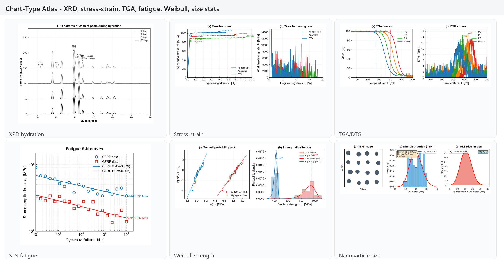
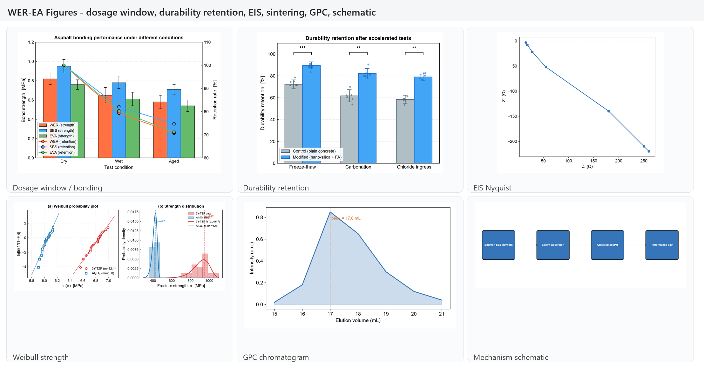
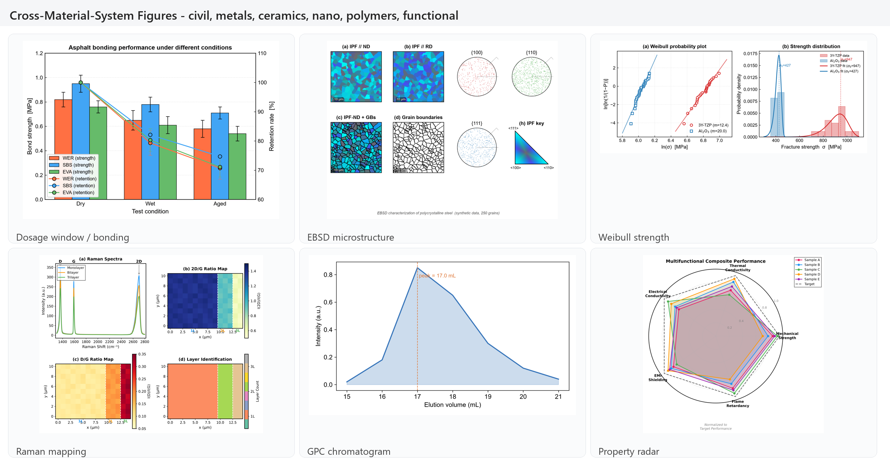

# Materials Science Skills

A full-cycle **materials-science research skill bundle** for AI coding agents:
routing, deep-reading cards, citation and reference verification, statistics
reporting, writing, figures (incl. AI-model + R hybrid composition), data,
DOE, peer review, reviewer responses, and paper-to-patent conversion in one
evidence-gated workflow.

面向材料科学科研全流程的 Agent 技能包：从文献路由、深读卡、引文与参考文献
校验、统计报告、写作、配图（含 AI 模型 + R 混合合成）、数据打包、实验设计
到审稿模拟、回复信与论文转专利，以证据契约贯穿每一步。中文请求可直达触发。

**16 skills · 29 material systems · 17 journal format guides · 9 domain data schemas · 7+ agent platforms**

<table>
  <tr>
    <td></td>
  </tr>
  <tr>
    <td></td>
  </tr>
  <tr>
    <td></td>
  </tr>
</table>

## Capabilities 能力一览

`materials-research` 路由一切任务；每步输出经证据契约门控后交接给下一技能。
`materials-research` routes every request; each stage is gated by its previous
output contract before handoff.

```text
research (router) → reader → citation / literature-pipeline
                 → writing → polishing → statistics
                 → figure → data → doe
                 → reviewer → response / submission / html-deck / paper-to-patent
```

### Skill index (16 skills)

| Skill | Status | Purpose | Trigger keywords |
|---|---|---|---|
| [`materials-research`](plugins/materials-skills/skills/materials-research/README.md) | Stable | Profile-first router, stage-gated plan, coverage_tier report | "materials research", "topic routing", "workflow plan" |
| [`materials-reader`](plugins/materials-skills/skills/materials-reader/README.md) | Stable | Source-anchored reader package, evidence-chain matrix | "reader package", "evidence chain", "paper notes" |
| [`materials-citation`](plugins/materials-skills/skills/materials-citation/README.md) | Stable | MCP-backed search, citation matrix, reference-gap audit, reference verification | "citation matrix", "literature screening", "reference gap" |
| [`materials-literature-pipeline`](plugins/materials-skills/skills/materials-literature-pipeline/README.md) | Beta | Recurring discovery, candidate scoring, source-depth labels, digest handoff | "literature pipeline", "daily digest", "candidate scoring" |
| [`materials-paper-card`](plugins/materials-skills/skills/materials-paper-card/README.md) | Beta | Source-grounded 16-section deep-reading cards, characterization-chain reading, gated research ideas | "paper card", "deep reading", "深读卡" |
| [`materials-writing`](plugins/materials-skills/skills/materials-writing/README.md) | Stable | 8-axis stateful manuscript drafting, foundation files, section arcs | "manuscript draft", "review outline", "argument chain" |
| [`materials-polishing`](plugins/materials-skills/skills/materials-polishing/README.md) | Stable | Claim-strength audit, overclaim reduction, journal-tone tightening | "polish", "claim strength", "academic tone" |
| [`materials-figure`](plugins/materials-skills/skills/materials-figure/README.md) | Stable | LLM-driven figure contract + plot, representative atlas/gallery samples | "figure", "publication plot", "mechanism map" |
| [`materials-data`](plugins/materials-skills/skills/materials-data/README.md) | Stable | FAIR package, 9 domain schemas, data availability statement | "FAIR package", "data availability", "dataset" |
| [`materials-doe`](plugins/materials-skills/skills/materials-doe/README.md) | Stable | Factorial / Taguchi / mixture matrices, methods paragraph | "DOE", "experiment design", "orthogonal array" |
| [`materials-statistics`](plugins/materials-skills/skills/materials-statistics/README.md) | Beta | Replicate/n audits, ANOVA/Taguchi/RSM reporting, multiple-comparison fixes, figure-statistics alignment | "statistics review", "p-value", "方差分析", "图注统计" |
| [`materials-reviewer`](plugins/materials-skills/skills/materials-reviewer/README.md) | Stable | 5-axis peer review, 22 domain criteria, desk-reject risk | "peer review", "desk-reject risk", "reviewer report" |
| [`materials-response`](plugins/materials-skills/skills/materials-response/README.md) | Beta | Point-by-point response, rebuttal package, action mapping | "response letter", "rebuttal", "reviewer comment" |
| [`materials-html-deck`](plugins/materials-skills/skills/materials-html-deck/README.md) | Beta | Browser-native HTML academic deck with strict Playwright QA | "html deck", "academic deck", "paper to slides", "journal club" |
| [`materials-paper-to-patent`](plugins/materials-skills/skills/materials-paper-to-patent/README.md) | Beta | Chinese invention-patent application, civil patent KB, claim validator | "patent", "claim", "invention disclosure" |
| [`materials-submission`](plugins/materials-skills/skills/materials-submission/README.md) | Beta | Route C package assembly for 10 supported journal templates | "submission package", "cover letter", "highlights" |

> `Stable` = documented, installable, covered by the public release gate.
> `Beta` = functional but still accumulating domain coverage.

## Flagship highlights 旗舰亮点

- **`materials-figure`** — LLM-driven figure creation: validates a figure
  contract and source-data anchor first, then the LLM writes `plot.py` and
  ships a full package (`figure_contract.md → source_data.csv → plot.py →
  SVG/PDF/PNG/TIFF → caption.md + qa_report.md`). Python-default backend
  (R opt-in); a hybrid composition mode that requires a user-provided AI
  image model (GPT Image 2, nanobanana, …) — AI decorates only, R draws
  every text/border/arrow/annotation as vector, with a full R/Python
  fallback (procedural decorations) when no tool is available.
- **`materials-paper-to-patent`** — 论文转中文发明专利：三轴路由
  （source_format / task_mode / invention_type），内置中国专利法第 22/26.3/
  26.4/31.1/33 条知识库与 7 规则 claim 校验引擎，输出 DOCX 申请稿 +
  flowchart.svg。
- **`materials-research`** — 路由中枢：17 task / 36 domain / 20 journal
  片段驱动，输出 6 阶段门控计划与 `coverage_tier`（full/partial/skeleton/
  generic）报告。
- **`materials-writing`** — 8 轴状态机写作（writing_mode / paper_type /
  section / language / journal_family / material_family / domain /
  input_source），`state.json` 追踪修订轮次与证据缺口。
- **`materials-data`** — 9 套领域数据 schema（asphalt / cement-concrete /
  ceramics / civil / functional / metals / nano / polymers /
  thermal-insulation），FAIR 审计 + 期刊就绪的 data-availability 声明。

每个技能的关键规则、输出结构与完整文档见
[docs/skills-index.md](docs/skills-index.md)。

## Quick Start 快速开始

```text
Help me run a WER-EA mini-review workflow from screening to figure planning.
```

四个完整工作流演示（WER-EA mini-review、实验手稿、修订循环、论文转
HTML deck）见 [docs/workflows/README.md](docs/workflows/README.md)。

安装或更新后做一次本地验证：

```powershell
python .\scripts\run_release_checks.py --json
```

## Platform support 平台支持

| Platform | Install | Skills location |
|---|---|---|
| Claude Code | `python scripts/install_skills.py --target claude` | `~/.claude/skills/` (or `.claude-plugin/` marketplace) |
| OpenCode | `python scripts/install_skills.py --target opencode` | `~/.config/opencode/skills/` |
| Antigravity | `python scripts/install_skills.py --target antigravity` | `~/.gemini/config/skills/` |
| ZCode | `python scripts/install_skills.py --target zcode` (or `.zcode-plugin/` marketplace) | `~/.zcode/skills/` |
| Codex | `python scripts/install_skills.py --target codex` (or `scripts/install.ps1`) | `$CODEX_HOME/skills/` |
| deepseek-harness (dsh) | `python scripts/sync_dsh_skills.py` (or `--patch ./dsh/cordis.patch.yml`) | project `.dsh/skills/` |
| Any SKILL.md agent | `python scripts/install_skills.py --target generic --dest <dir>` | anywhere |

## Installation 安装

```bash
python scripts/install_skills.py --target claude --dry-run   # preview first
python scripts/install_skills.py --target claude
python scripts/install_skills.py --target zcode              # or the .zcode-plugin marketplace
python scripts/sync_dsh_skills.py                            # dsh: project .dsh/skills/
python scripts/autoupdate_skills.py --target claude           # session-start auto-update
```

安装器会把每个 skill 物化为自包含目录（合并 `_shared` 树、重写相对引用）、
按平台注册 `materials-academic-search` MCP，并在安装后校验全部引用。
The installer materializes self-contained skills, registers the MCP server per
platform, and verifies references. 详见 [install.md](install.md) 与
[adapters/README.md](adapters/README.md)。

## Documentation 文档导航

- [docs/skills-index.md](docs/skills-index.md) — 16 技能细节、关键规则与输出结构
- [docs/gallery/README.md](docs/gallery/README.md) — 配图能力图板
- [docs/workflows/README.md](docs/workflows/README.md) — 四个端到端工作流演示
- [docs/showcases/README.md](docs/showcases/README.md) — submission / reviewer-response / FAIR-data 成果展示
- [docs/coverage-dashboard.md](docs/coverage-dashboard.md) — 29 材料体系覆盖度
- [docs/autoupdate.md](docs/autoupdate.md) — 会话启动自动更新（节流/离线安全/仅快进）

## Scope & Roadmap 边界与路线图

- 本包强化科研工作的证据、路由与打包纪律，不替代深度阅读、真实实验证据、
  导师判断、期刊官方要求或机构规定。
- 公开仓库只随附轻量发布门；内部回归套件与完整配图资产为维护者侧资产。
- **Submission end-to-end** is supported for 10 supported journal templates
  through `materials-submission`. The initial four-journal pilot (CBM, CCC,
  RMPD, JBE) is historical rollout context, not the current support boundary;
  seven journal-format guides remain without submission templates.
- 基金写作（`materials-grant`）不在当前范围；`materials-doe` 只做实验设计，
  不执行实验。

## Acknowledgements 致谢

仓库结构与技能包打包方式受
[nature-skills](https://github.com/Yuan1z0825/nature-skills)（Yizhe Yuan）启发。
