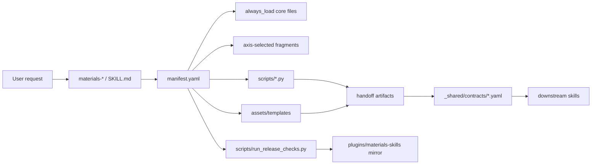

# Maintainer Handoff Guide

这份文档给接手维护 `Materials Science Skills` 的工程师使用。它不重复
`README.md` 的产品介绍，而是说明当前 `main` 分支的代码架构、事实源、
扩展流程、验证命令，以及哪些地方最容易退化成难维护代码。

## 先读什么

建议按这个顺序进入项目：

1. `README.md`：理解这个仓库面向的用户和四条主要工作流。
2. `docs/skills-index.md`：快速看 12 个 `materials-*` 技能的职责边界。
3. `docs/architecture/skill-architecture.md`：理解每个技能目录必须具备的结构。
4. 本文档：理解维护规则、风险点和实际改法。
5. `docs/architecture/release-gate-contract.md`：理解 release gate 能证明什么、不能证明什么。

## 总体架构

当前架构是一个 Codex skill bundle，而不是单一 Python 应用。核心设计是：

- `skills/materials-*` 是源代码事实源，每个目录是一项可安装技能。
- `manifest.yaml` 是路由、资源、测试、handoff 和 release metadata 的事实源。
- `_shared/contracts/*.yaml` 定义跨技能交接物的契约。
- `plugins/materials-skills/` 是安装包镜像，发布前必须和源技能保持同步。
- `scripts/*.py` 是结构验证、发布检查和可复用生产辅助脚本。
- `mcp-server/materials-academic-search/` 是仓库根部可直接配置的 MCP server。
- `skills/materials-citation/mcp/academic_search/` 是随 citation skill 安装的 MCP 实现。



这套系统最重要的架构原则是：**结构关系尽量从 manifest 和 contract 推导，
不要靠脚本里的手写清单维持。**

## 目录职责

| 路径 | 职责 | 维护规则 |
|---|---|---|
| `skills/materials-*/SKILL.md` | 技能入口和调用协议 | 保持短；负责路由，不塞长篇领域知识 |
| `skills/materials-*/manifest.yaml` | 路由轴、触发词、资源、测试、handoff、release checks | 新增路径必须真实存在；新增 handoff 必须和 contract 对齐 |
| `skills/materials-*/static/core/` | 每次调用都需要的稳定承诺和流程 | 内容要小而稳定；重领域内容放 references |
| `skills/materials-*/static/fragments/` | 常用路由片段 | 适合高频、低体积上下文 |
| `skills/materials-*/references/` | 大块领域指南、期刊规则、写作/审稿方法 | 只在 manifest route 选中时加载 |
| `skills/materials-*/assets/templates/` | 交付物模板、CSV/MD/JSON schema-like 文件 | 字段变化要同步测试和 handoff contract |
| `skills/materials-*/scripts/` |  deterministic helper scripts | 优先 JSON 输出；测试覆盖关键行为 |
| `skills/materials-*/tests/` | 单技能结构和行为回归测试 | 用 `unittest.TestCase`，文件名 `test_*.py` |
| `skills/_shared/` | 跨技能共享 stance、evidence、paper-production 规则 | 不是普通生产技能；不要随意改成技能目录 |
| `_shared/contracts/` | 跨技能 artifact 契约 | `produced_by` 和 `consumed_by` 必须和 manifests 一致 |
| `plugins/materials-skills/` | Codex plugin installable mirror | 源技能改了，这里通常也要同步 |
| `mcp-server/materials-academic-search/` | 根部 MCP server 配置入口 | 和 skill 内 MCP schema 保持 lockstep |
| `scripts/` | 发布门禁和结构校验 | 不要重新引入静态技能清单 |

## 技能内部结构

每个生产技能的目标结构如下：

```text
skills/materials-<name>/
  SKILL.md
  manifest.yaml
  agents/openai.yaml
  static/core/
    contract.md
    workflow.md
  static/fragments/
  references/
  assets/templates/
  scripts/
  tests/
  README.md
```

`SKILL.md` 是轻入口；`manifest.yaml` 决定加载什么；`static/core` 是每次都要
遵守的底线；`references` 是按需加载的厚资料；`assets/templates` 和 `scripts`
产出可复用交付物；`tests` 保证技能结构和行为不会漂移。

接手后不要把长篇学科指南直接塞进 `SKILL.md`。这样短期看省事，长期会让
技能入口臃肿、触发模糊、上下文成本失控。

## Manifest 是事实源

新增或修改技能时，优先改 `manifest.yaml`，再让校验脚本从 manifest 发现结构。
当前共享发现逻辑在 `scripts/skill_manifest.py`：

- 技能发现规则：`skills/materials-*` 目录，并且包含 `manifest.yaml`。
- 稳定顺序：按路径排序。
- 读取方式：UTF-8 YAML mapping。

维护时要避免这些反模式：

- 在脚本里新增 `ALL_SKILLS = [...]`。
- 在测试里手写完整技能列表，除非测试目标是文档呈现顺序。
- 在 handoff 校验里写死 provider/consumer 拓扑。
- 在 release gate 文本里用字符串证明某个技能存在。

如果确实需要一个固定集合，先确认它是不是产品展示层需求；如果不是，通常应改成
从 `scripts/skill_manifest.py` 动态发现。

## Handoff 架构

跨技能交接由两处共同定义：

1. 生产/消费关系写在各技能 `manifest.yaml` 的 `handoffs.provides` 和
   `handoffs.consumes`。
2. artifact schema 写在 `_shared/contracts/<handoff-name>.yaml`。

`scripts/validate_handoffs.py` 会从所有 manifest 推导拓扑，并与 contract 比对：

- manifest 引用的 handoff 必须有对应 contract。
- 每个 consumer 声明的 provider 必须和实际 provider 一致。
- contract 的 `produced_by` 必须和 manifest provider 一致。
- contract 的 `consumed_by` 必须覆盖 manifest consumers。
- contract 里列出的 template path 必须存在。
- provider 不能产出完全无人消费的 orphan handoff。

因此，新增一个 handoff 时不要只改一个地方。最小改动集通常是：

1. 在生产技能 manifest 的 `handoffs.provides` 中声明 handoff。
2. 在 `_shared/contracts/<name>.yaml` 中定义 `produced_by`、`consumed_by`、
   `artifacts` 和 `templates`。
3. 在消费技能 manifest 的 `handoffs.consumes` 中声明消费关系。
4. 在源技能和 plugin mirror 中同步相关 manifest/contract/template。
5. 增加或更新测试，覆盖该 handoff 的字段和路由。

## Release Gate

总发布入口是：

```powershell
python scripts\run_release_checks.py --json
```

它不是单元测试全集的替代品，而是发布前的结构安全门。当前会覆盖：

- 每个动态发现到的 `materials-*` 技能基本文件存在性。
- paper-production 共享编排文件。
- writing/figure maturity 文件存在性。
- handoff contract 验证。
- manifest 路径和 contract/template 引用验证。
- behavioral scenario 发现。
- material registry 验证。
- architecture/plugin mirror 验证。
- 根部 academic-search MCP server 测试。

如果你改的是共享架构、manifest、handoff、MCP、plugin mirror 或 release scripts，
必须跑 release gate。只改文案也建议跑，因为这个仓库的文档和产品表面有契约测试。

## Plugin Mirror 规则

`skills/` 是事实源，`plugins/materials-skills/skills/` 是安装包镜像。发布前要保证
镜像一致。

当前 `scripts/check_skill_architecture.py` 会比较：

- 每个生产技能是否存在对应 plugin skill。
- router 文件和 static core 文件。
- 源技能树和 plugin 技能树的文件集合。
- 文本文件允许 CRLF/LF 行尾差异，但内容必须一致。

已知例外必须显式写在 checker 里，不能靠“大家知道”。目前保留的例外包括
`materials-figure/tests/test_figure_hard_workflow.py` 这类历史 root-only case。

维护建议：

- 先改 `skills/...` 源文件。
- 再同步到 `plugins/materials-skills/skills/...`。
- 再跑 `python scripts\check_skill_architecture.py --json`。
- 如果确实需要例外，在 `docs/architecture/release-gate-contract.md` 和 checker 中同时说明。

## MCP 架构

Academic search MCP 有两个入口：

- 根部：`mcp-server/materials-academic-search/`，给 `.mcp.json` 本地配置使用。
- 技能内：`skills/materials-citation/mcp/academic_search/`，随 citation skill 或 plugin 使用。

这不是最理想的单源设计，因为实现存在物理重复或近重复。当前控制方式是：

- 根部 `server.py` 保持 thin entrypoint。
- 真正 stdio JSON-RPC server 位于
  `mcp-server/materials-academic-search/academic_search/server.py`。
- 根部 MCP 测试和 skill MCP 测试都要跑。
- lockstep 测试比较两边 `tools/list` schema，防止工具面漂移。

后续如果要继续降债，最好的方向是抽出共享 MCP package 或生成 schema，而不是手工复制。
在那之前，新增 MCP tool 时必须同步两边 schema、服务实现、README、requirements 和测试。

## 新增技能流程

新增 `materials-<name>` 时按这个顺序做：

1. 创建 `skills/materials-<name>/` 标准目录结构。
2. 写短 `SKILL.md`，只放触发范围、调用协议、默认输出、边界。
3. 写 `manifest.yaml`，包含 `version`、`always_load`、`axes`、`assets`、
   `scripts`、`tests`、`quality_gates`、`handoffs`、`release_checks`。
4. 补 `static/core/contract.md` 和 `static/core/workflow.md`。
5. 把大块领域知识拆到 `references/` 或 `static/fragments/`。
6. 添加模板、脚本和测试。
7. 如果有交接物，添加 `_shared/contracts/<handoff>.yaml` 并声明 consumers。
8. 复制到 `plugins/materials-skills/skills/materials-<name>/`。
9. 更新公开文档，例如 `docs/skills-index.md` 和 README 中的技能表。
10. 跑验证矩阵。

关键点：不要为了让 release gate 过而在脚本里补静态特殊逻辑。新技能应该被
`scripts/skill_manifest.py` 自动发现。

## 新增或修改材料领域流程

材料覆盖通常牵涉多个技能，而不是只改 `materials-research`：

- 路由入口：`skills/materials-research/manifest.yaml` 和对应 domain fragment。
- 写作叙事：`skills/materials-writing/references/*-narrative.md`。
- 审稿标准：`skills/materials-reviewer/references/*-criteria.md`。
- 图表表达：`skills/materials-figure/references/` 或 atlas assets。
- 数据模板：`skills/materials-data/assets/templates/` 或 domain schema。
- 注册表：`_shared/material-registry/entries/*.yaml`。
- 覆盖文档：`docs/coverage-dashboard.md`。

新增领域时特别注意：

- 不要恢复泛化的 “anything not listed” 路由；产品文档测试会拒绝一些旧 fallback 文案。
- 不要虚构材料支持深度；registry 的 coverage tier 要和实际资源匹配。
- 触发词可以包含中文，但必须是 UTF-8，不要引入 mojibake。

## 修改模板或字段流程

字段名是这个仓库最容易暗中漂移的地方。修改 CSV/MD/JSON 模板时至少检查：

- 对应 `assets/templates/*`。
- 相关 `_shared/contracts/*.yaml` 的 artifact 描述。
- 生产脚本输出字段。
- 消费脚本或 downstream skill reference。
- 单技能测试和根部 contract 测试。
- plugin mirror 中的同名文件。

如果一个字段跨 citation、reader、figure、writing 使用，优先保留旧字段并新增字段，
再通过测试明确迁移边界；不要直接改名导致 downstream handoff 断裂。

## 当前技术债和“屎山风险”

我不建议把当前 main 评价为典型“屎山代码”。它的边界和 release gate 已经比较清楚。
但确实存在几块高风险区域，如果维护方式不稳，会很快退化：

| 区域 | 风险 | 当前控制方式 | 建议 |
|---|---|---|---|
| Plugin mirror | 源文件和安装包镜像物理重复，容易漏同步 | architecture checker 做 byte/text identity 检查 | 改源后立即同步 mirror；长期可考虑生成式同步 |
| MCP 双入口 | 根部 MCP 和 skill MCP 容易 schema 漂移 | 双测试套件 + `tools/list` lockstep | 新增 tool 时两边一起改，一起测 |
| Release gate 脚本 | 历史上容易堆特殊 case | `skill_manifest.py` 动态发现 | 新规则做成通用 validator，不要写死技能拓扑 |
| Handoff 字段 | 多技能共享字段容易改一处漏三处 | `_shared/contracts` + manifest topology validator | 字段变化先改 contract，再改 producer/consumer/tests |
| 大型 manifest | 触发词、路径和轴多，人工维护易错 | manifest path validation + mojibake scan | 小步修改；按 axis 增量测试 |
| 生成资产 | figure/gallery 中有大量 PNG/SVG/PDF | 文档测试检查真实视觉资产 | 不要提交临时输出；只提交可解释的 proof assets |
| 文档契约 | README/docs 同时是产品表面和测试对象 | `tests/test_product_docs_contract.py` | 改公开文档后跑文档测试 |

一句话判断：**不是没结构，而是重复面较多；只要绕开 manifest/contract/release gate，
重复面就会变成维护泥潭。**

## 常见误改

避免以下操作：

- 把 `scripts/validate_handoffs.py` 改回手写 provider/consumer 表。
- 在 `scripts/run_release_checks.py` 中枚举所有技能名。
- 只改 `skills/` 不改 `plugins/materials-skills/`。
- 只改 template 不改 contract 和测试。
- 只改 MCP README 不改 `.mcp.json`、requirements、server entrypoint 和测试。
- 把真实论文数据、用户私有数据或本地运行输出提交进仓库。
- 为了压过失败测试删除 release gate bucket。
- 在 `SKILL.md` 中塞入过长的领域手册，导致 router 失去轻入口职责。
- 在 Windows PowerShell 命令里使用 `&&`；按项目约定使用 `; if ($?) { ... }`。

## 验证矩阵

按变更类型选择命令：

| 变更类型 | 最小验证 |
|---|---|
| 任意 release 前 | `python scripts\run_release_checks.py --json` |
| 根部架构、manifest、mirror | `python scripts\check_skill_architecture.py --json` |
| 根部测试契约 | `python -m unittest discover -s tests -p "test_*.py" -v` |
| 单个技能 | `python -m unittest discover -s skills\materials-<name>\tests -p "test_*.py" -v` |
| citation skill MCP | `python -m unittest discover -s skills\materials-citation\mcp\academic_search\tests -p "test_*.py" -v` |
| 根部 MCP | `python -m unittest discover -s mcp-server\materials-academic-search\academic_search\tests -p "test_*.py" -v` |
| 产品文档/README/gallery/showcase | `python -m unittest tests.test_product_docs_contract -v` |
| handoff contract | `python scripts\validate_handoffs.py --json` |
| manifest path/schema | `python scripts\validate_manifest.py --json` |

改动越靠近共享层，验证越要向上扩。修改 `_shared/contracts`、`scripts/`、MCP 或
plugin mirror 时，建议跑 release gate 加根部全量 tests。

## 接手时的工作流

日常维护建议：

1. 先看 `git status --short`，确认已有未提交改动，不要覆盖用户或前序工作。
2. 读相关 skill 的 `manifest.yaml`、`SKILL.md`、`static/core/*` 和 tests。
3. 如果改 cross-skill artifact，先读 `_shared/contracts`。
4. 先写或更新测试，再改实现或文档。
5. 源技能改完后同步 plugin mirror。
6. 跑对应最小测试。
7. 跑 `python scripts\run_release_checks.py --json`。
8. 最后再整理 release notes 或公开文档。

如果遇到 release gate 失败，不要先绕 gate。先判断失败属于：

- 文件缺失：manifest 或 mirror 路径漏同步。
- contract mismatch：manifest 的 provides/consumes 与 `_shared/contracts` 不一致。
- MCP mismatch：根部和 skill MCP tool schema 不一致。
- 文档契约：README/docs 与 registry 或 proof assets 不一致。
- 真实行为失败：脚本输出、字段、测试期望需要一起迁移。

## 后续可降债方向

优先级从高到低：

1. 为 plugin mirror 做同步脚本或 CI 自动检查，减少人工复制。
2. 抽出 academic-search MCP 共享 package，避免根部和 skill 内实现重复。
3. 让 release gate 输出更细的 bucket summary，方便快速定位失败。
4. 扩大 manifest-driven discovery 覆盖面，清掉剩余产品层静态技能列表。
5. 给 handoff contract 增加更严格的字段类型/schema 校验，而不只是存在性校验。

这些都不是接手第一天必须做的事。第一原则仍然是：保持 manifest、contract、mirror、
tests 和 release gate 同步。
