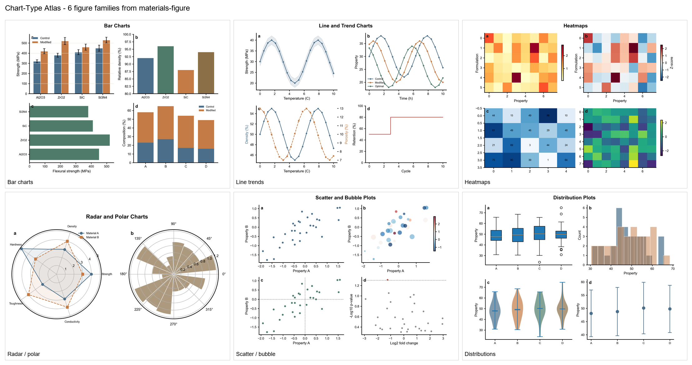
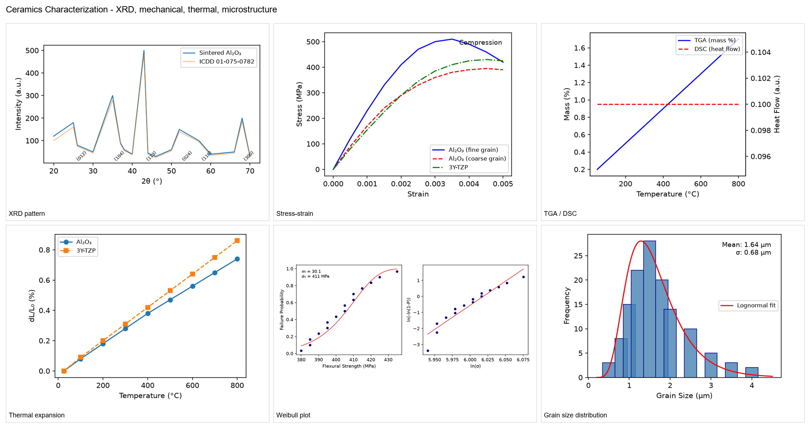
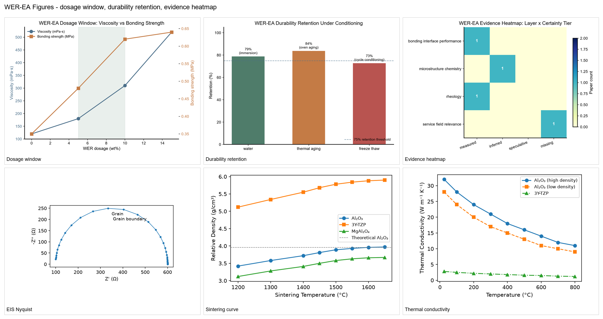

# Materials Science Gallery

Visual proof boards, chart-type atlases, and worked figure packages generated
by the `materials-figure` skill. Every board here is real output from the
current code; nothing is mock-up.

## Screenshot Gallery

## Workflow Proof

The proof boards above are tracked under
`plugins/materials-skills/skills/materials-figure/assets/showcase-proof/` and
are referenced by the Codex plugin metadata. They show the reader-package,
WER-EA figure, SBR-WER performance, and interlayer-fatigue routes with real
visual signal.

## Artifact Deep Dives

### Composite Gallery Boards (3)

Three composite boards, each assembling 6 representative figures into a single
overview image. All figures are generated from the current chart-type atlas,
gallery proof assets, and `materials4papers` top-journal-style examples under
`plugins/materials-skills/skills/materials-figure/assets/`.

### Chart-Type Atlas — 6 of 21 figure families

A single overview image showing six chart-type families. The full atlas
contains **21 PNG boards** covering every common materials-science figure
genre:

| ID | Family | What it answers |
|---|---|---|
| `atlas-01-xrd-diffraction` | X-ray diffraction | "What's the phase composition?" |
| `atlas-02-mechanical-curves` | Stress-strain / load-displacement | "How does it perform under load?" |
| `atlas-03-thermal-analysis` | TGA / DSC / DTG | "How does it behave with temperature?" |
| `atlas-04-spectroscopy` | FTIR / Raman / XPS | "What bonds and species are present?" |
| `atlas-05-microscopy` | SEM / TEM / OM plates | "What does the microstructure look like?" |
| `atlas-06-performance-bar` | Performance bar / radar | "How does it compare on a metric?" |
| `atlas-07-durability` | Durability / retention | "How does it hold up over time?" |
| `atlas-08-electrochemistry` | CV / LSV / GCD | "What does the electrochemistry show?" |
| `atlas-09-comparison` | Cross-sample comparison | "How do samples stack up against each other?" |
| `atlas-10-composite-layout` | Multi-panel composite layout | "How to assemble a journal figure?" |
| `atlas-11-phase-diagram` | Phase diagram / pseudo-binary | "What's the equilibrium state?" |
| `atlas-12-kinetics` | Kinetic / Avrami plots | "How does the reaction proceed?" |
| `atlas-13-adsorption` | Adsorption isotherm / kinetic | "How does it interact with the sorbate?" |
| `atlas-14-rheology` | Viscosity / modulus sweeps | "How does it flow?" |
| `atlas-15-degradation` | Degradation / ageing | "How does it break down?" |
| `atlas-16-pore-size-distribution` | Pore size / BET | "What's the porosity structure?" |
| `atlas-17-electrochemical-impedance` | EIS Nyquist / Bode | "What are the charge-transfer properties?" |
| `atlas-18-mercury-intrusion` | MIP / mercury intrusion | "What's the pore-size distribution?" |
| `atlas-19-multiscale-architecture` | Multiscale architecture | "How do nano/micro/macro features relate?" |
| `atlas-20-mechanism-flowchart` | Mechanism flowchart | "What is the proposed mechanism?" |
| `atlas-21-graphical-abstract` | Graphical abstract | "What's the one-glance story?" |

### WER-EA Figures — dosage window, durability retention, evidence heatmap

A representative bundle for the WER-EA (waterborne epoxy–asphalt)
domain, the most polished end-to-end mini-review workflow in the bundle.
Drives `materials-research` → `materials-citation` → `materials-reader` →
`materials-writing` → `materials-figure` in one pass, with concrete figures
for dosage window, durability retention, and evidence heatmap.

### Cross-Material-System Figures — 6 of 12 gallery composites

A single overview image showing six composite proof figures spanning
cement hydration, polymer composites, steel microstructure, ceramics
reliability, asphalt modification, concrete durability, and functional
coating. The full gallery contains **12 PNG composites**, one per
canonical paper type:

| File | What it demonstrates |
|---|---|
| `fig1-cement-hydration-mechanism` | Cement hydration + mechanism |
| `fig2-steel-microstructure-property` | Steel microstructure → property link |
| `fig3-polymer-composite-multifunctional` | Polymer composite multi-functional performance |
| `fig4-ceramics-reliability-assessment` | Ceramics Weibull reliability assessment |
| `fig5-asphalt-modification-review` | Asphalt modification review (multi-panel) |
| `fig6-nano-material-characterization` | Nano-material characterization (XRD + SEM + electrochemistry) |
| `fig7-concrete-microstructure-durability` | Concrete microstructure + durability |
| `fig8-functional-coating-performance` | Functional coating multi-panel performance |
| `fig9-multipanel-xrd-sem-perf` | XRD + SEM + performance multi-panel |
| `fig10-multipanel-ftir-tg-morph` | FTIR + TG + morphology multi-panel |
| `fig11-graphical-abstract` | Graphical abstract template |
| `fig12-evidence-chain` | Evidence-chain visual summary |

### Figure-package worked examples (20 `materials4papers`)

The full set of **20 worked figure packages** lives under
[`plugins/materials-skills/skills/materials-figure/assets/materials4papers/`](../../plugins/materials-skills/skills/materials-figure/assets/materials4papers/).
Each directory is a complete figure package: `figure_contract.md` +
`source_data.csv` + `plot.py` + `figure.svg` / `figure.png` / `figure.pdf`
+ `caption.md` + `qa_report.md` + `asset_manifest.md`.

| Directory | Domain | Figure highlight |
|---|---|---|
| `cement_hydration_xrd` | cement | Stacked XRD across hydration time |
| `steel_microstructure_ebsd` | metals | EBSD IPF maps + property overlay |
| `polymer_thermal_degradation` | polymer | TGA / DTG thermal degradation curves |
| `ceramics_weibull_reliability` | ceramics | Weibull reliability assessment |
| `2d_material_raman_mapping` | nano / 2D | Raman mapping of 2D material flakes |
| `nanoparticle_size_distribution` | nano | Size distribution + fit |
| `asphalt_bonding_performance` | asphalt | Bonding performance across modifiers |
| `concrete_durability_retention` | concrete | Durability retention over cycles |
| `multifunctional_composite_radar` | polymer composite | Multi-metric radar |
| `composite_fatigue_sn` | composite | S-N fatigue curve |
| `alloy_stress_strain` | metals | Stress-strain curves with overlay |
| `tack_coat_interface_schematic` | asphalt | Interface schematic |
| `13-multiscale_graphical_abstract` | multiscale | Multiscale graphical abstract |
| `14-hierarchical_mechanism_schematic` | mechanism | Hierarchical mechanism schematic |
| `15-ceramic_nyquist_plot` | ceramics | EIS Nyquist plot |
| `16-polymer_gpc_chromatogram` | polymer | GPC chromatogram |
| `17-nano_gisaxs_2d` | nano | GISAXS 2D pattern |
| `18-in_situ_xrd_thermal` | in-situ | In-situ XRD with thermal ramp |
| `19-multifield_temperature_strain` | multifield | Temperature / strain multifield |
| `20-asphalt_fracture_ct_reconstruction` | asphalt | CT reconstruction of fracture |

### Quantitative summary

| Asset layer | Count | Location |
|---|---|---|
| Chart-Type Atlas | **21 PNG** | `plugins/materials-skills/skills/materials-figure/assets/chart-atlas/` |
| Gallery composites | **12 PNG** | `plugins/materials-skills/skills/materials-figure/assets/gallery/` |
| `materials4papers` worked examples | **20 packages** | `plugins/materials-skills/skills/materials-figure/assets/materials4papers/` |
| Composite boards (this folder) | **3 PNG** | `docs/gallery/` |
| **Total production-grade figure assets** | **53 PNG + 20 packages** | — |

The figure-package architecture is described in
[`plugins/materials-skills/skills/materials-figure/README.md`](../../plugins/materials-skills/skills/materials-figure/README.md#figure-package-structure).

## Outcome Showcases

See [docs/showcases](../showcases/README.md) for the submission package,
reviewer-response, and FAIR-data package routes that use these proof assets.
