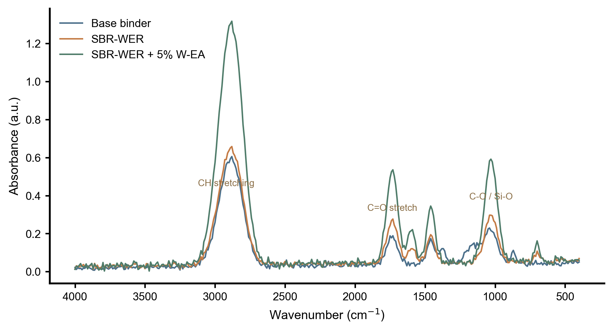
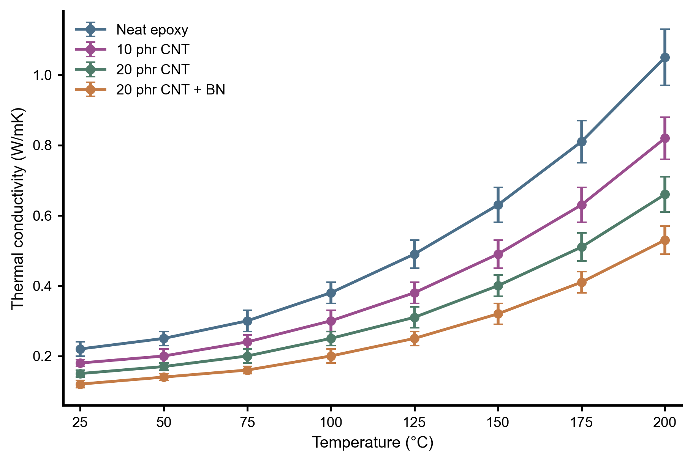
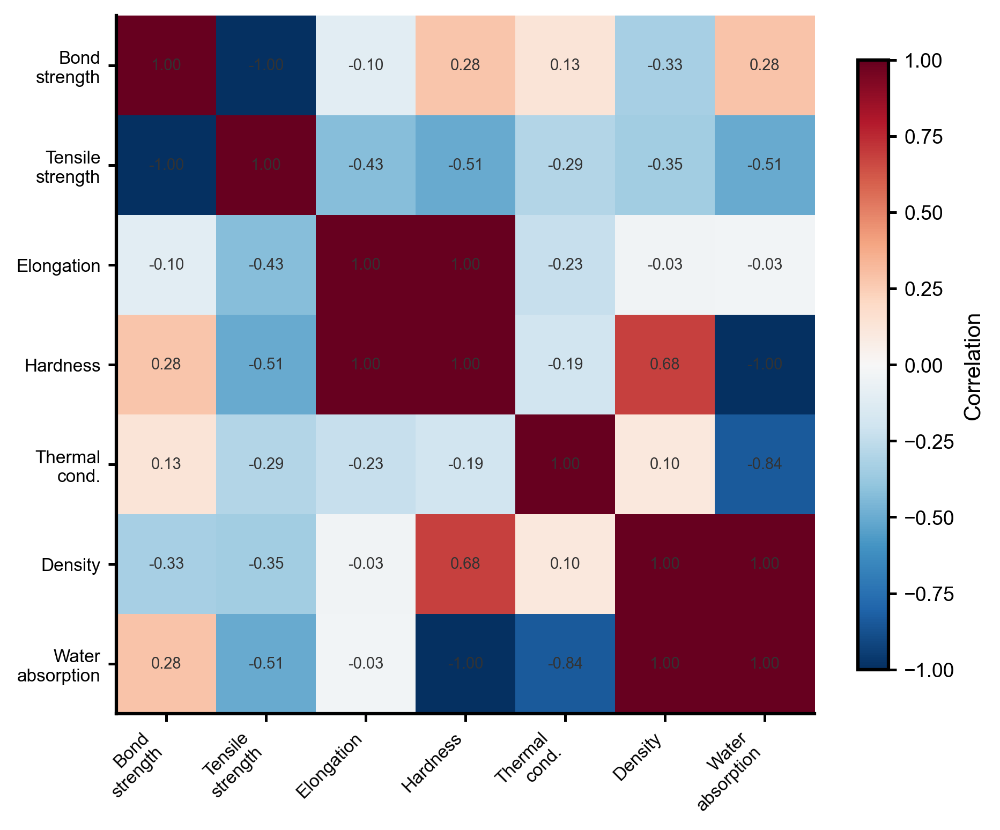

# Materials Science Gallery

Publication-ready figures generated by the materials figure system.

## Multi-panel Overview

2×2 editorial layout covering four core chart families: grouped bar, line trend, scatter with regression, and radar.

## FTIR Spectral Overlay

Overlay comparison of FTIR spectra across formulation variants with annotated functional group peaks.

## Thermal Performance

Multi-series line chart with error bars showing temperature-dependent thermal conductivity across composite formulations.

## Property Correlation Heatmap

Correlation heatmap of material properties — demonstrates the figure system's ability to visualize multivariate relationships.

## Workflow Proofs

- [WER-EA mini-review demo](../workflows/wer-ea-mini-review.md)
- [Experimental manuscript demo](../workflows/experimental-manuscript.md)
- [Revision loop demo](../workflows/revision-loop.md)
- [Paper to presentation demo](../workflows/paper-to-presentation.md)

## Skills Index

- [docs/skills-index.md](../skills-index.md)
- [docs/showcases/README.md](../showcases/README.md)
