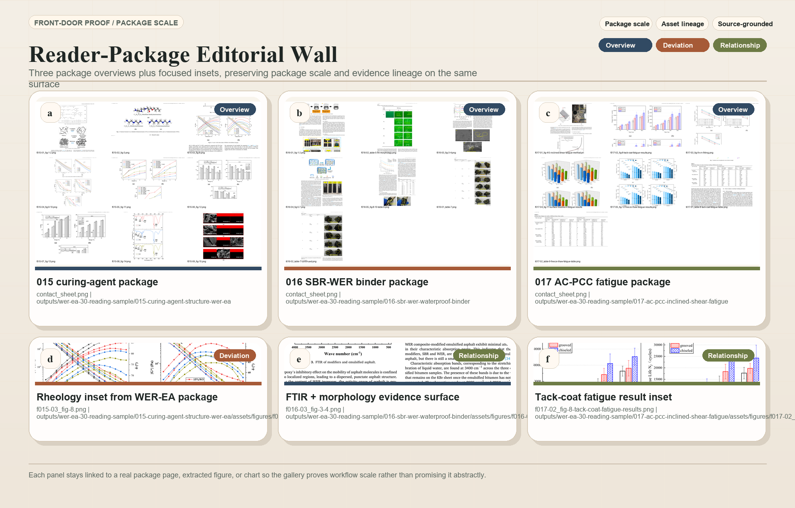
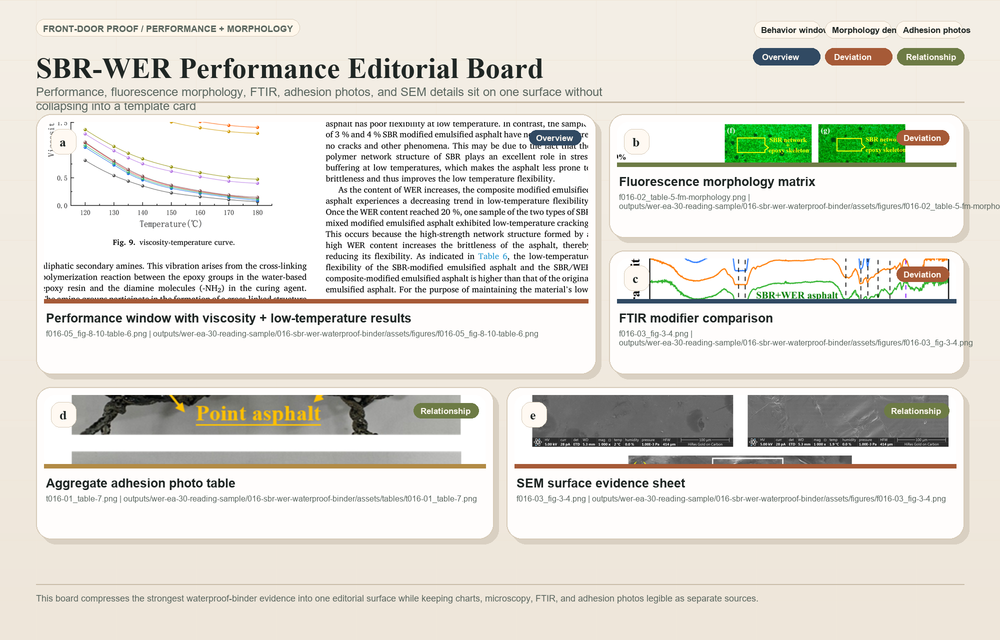
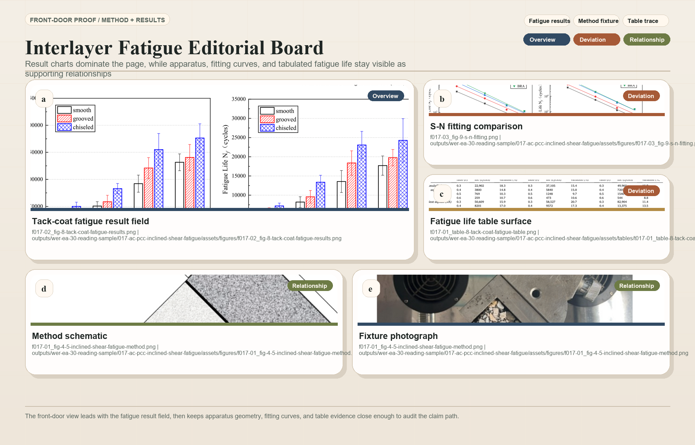

# Materials Science Gallery

Publication-ready proof boards generated by the materials figure system.

## Screenshot Gallery

Editorial proof boards for the WER-EA workflow surface.

## Workflow Proof

- [WER-EA mini-review demo](../workflows/wer-ea-mini-review.md)
- [Experimental manuscript demo](../workflows/experimental-manuscript.md)
- [Revision loop demo](../workflows/revision-loop.md)
- [Paper to presentation demo](../workflows/paper-to-presentation.md)

## Artifact Deep Dives

- [docs/skills-index.md](../skills-index.md)
- [docs/showcases/README.md](../showcases/README.md)

## Outcome Showcases

- [Submission package](../showcases/submission-package.md)
- [Reviewer response](../showcases/reviewer-response.md)
- [FAIR data package](../showcases/fair-data-package.md)
