# materials-figure

**What it does** — Generates journal-ready multi-panel figures for materials
manuscripts: mechanism maps, evidence heatmaps, dosage-window plots,
characterization panels, review figures, and full figure packages with source
data, caption boundaries, and export QA. Python-only backend, SVG-first
output, with PNG/PDF/TIFF export bundles. The skill treats figures as evidence
packages with source-anchored data, certainty-tier legends, and claim
boundaries instead of as loose images.

**Built from** — Five bundled atlases plus a figure-package template system:

- `assets/chart-atlas/` — 6 chart families with CSV data and SVG/PNG previews
- `assets/wer-ea-atlas/` — 20-panel atlas for waterborne epoxy resin modified
  emulsified asphalt, with CSV data and SVG templates
- `assets/ceramics-atlas/` — 9 characterization figures for structural/functional
  ceramics, with CSV data and SVG/PNG previews
- `assets/rich-gallery/` — 10 general materials figures (SVG/PNG + CSV data):
  bonding matrix, dosage window, FTIR+SEM pair, moisture retention,
  storage timeline, tack coat curve, cement hydration, LCA boundary card
- `assets/review-first/` — 10 review-oriented figures (SVG/PNG + CSV data):
  radar framework, evidence chain, gap matrix, test-method heatmap,
  durability challenge map, review graphical abstract
- `assets/templates/figure-package/` — contract, plot.py, caption, QA report,
  and asset manifest templates
- `scripts/figures4materials/` — 66 reusable plotting scripts for materials
  characterization (XRD, stress-strain, TGA/DSC, Weibull, EIS, sintering,
  rheology, FTIR, SEM, durability, corrosion, freeze-thaw, etc.)
- `examples/figure-packages/` — 7 runnable figure packages with real CSV data
  and matplotlib scripts (see below)

**Example output gallery** — Representative data-driven figures from the
rich-gallery and review-first collections. Each SVG/PNG pair is generated by a
matplotlib script from a CSV source; rerun `scripts/regenerate_gallery_assets.py`
to update all 20 figures at once.

| 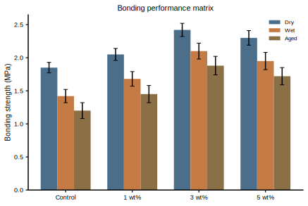 | 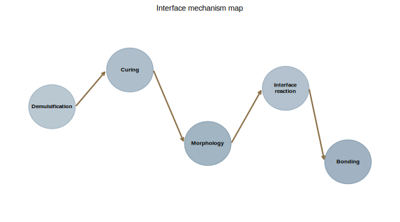 | 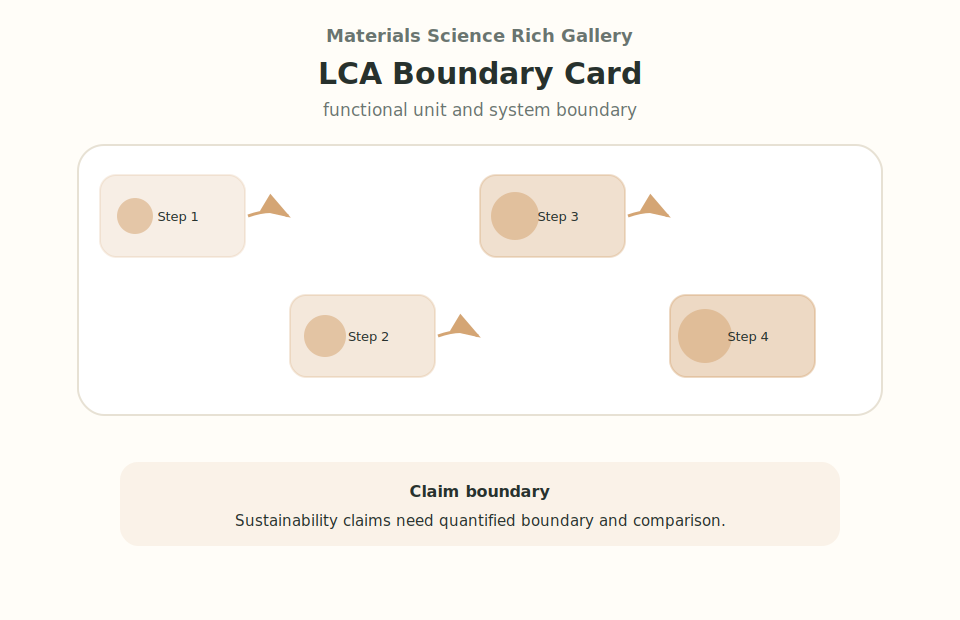 |
|---|---|---|
| 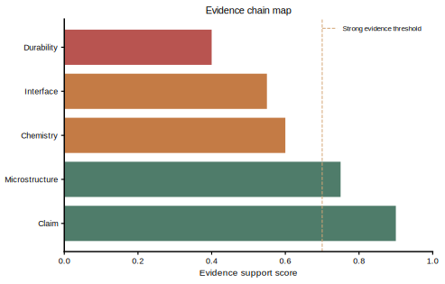 | 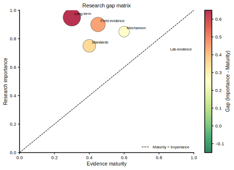 | 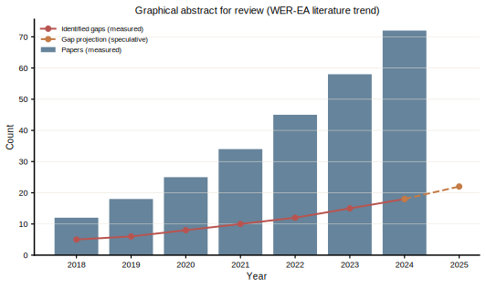 |

**Chart-type atlas** — The skill ships a chart-type atlas covering 6 chart
families. Each family has bundled CSV data and a generated SVG/PNG preview.

| 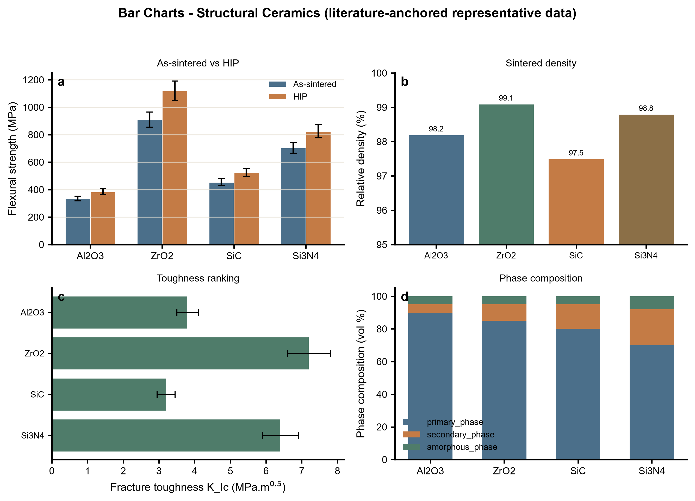 | 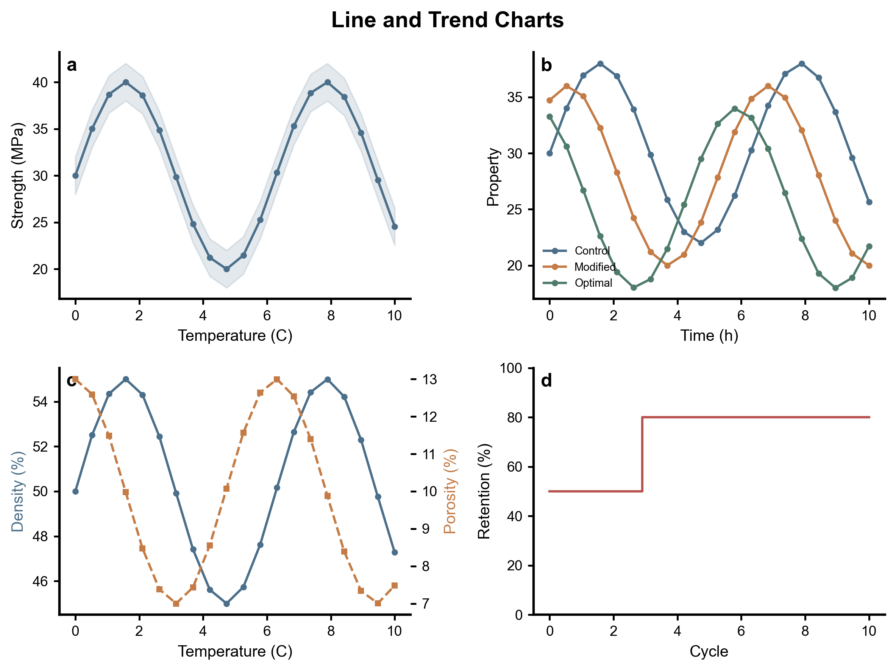 | 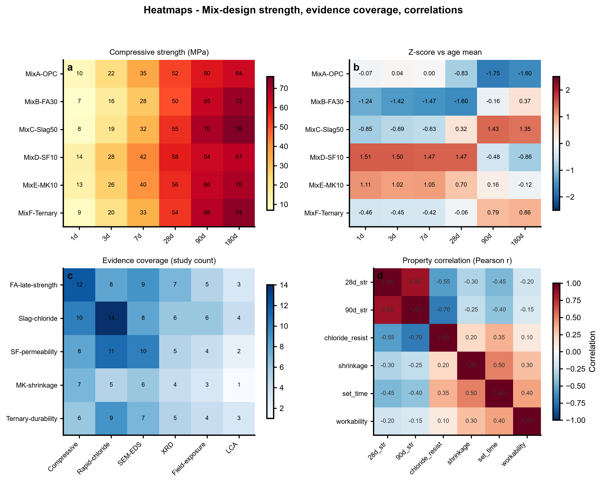 |
|---|---|---|
| 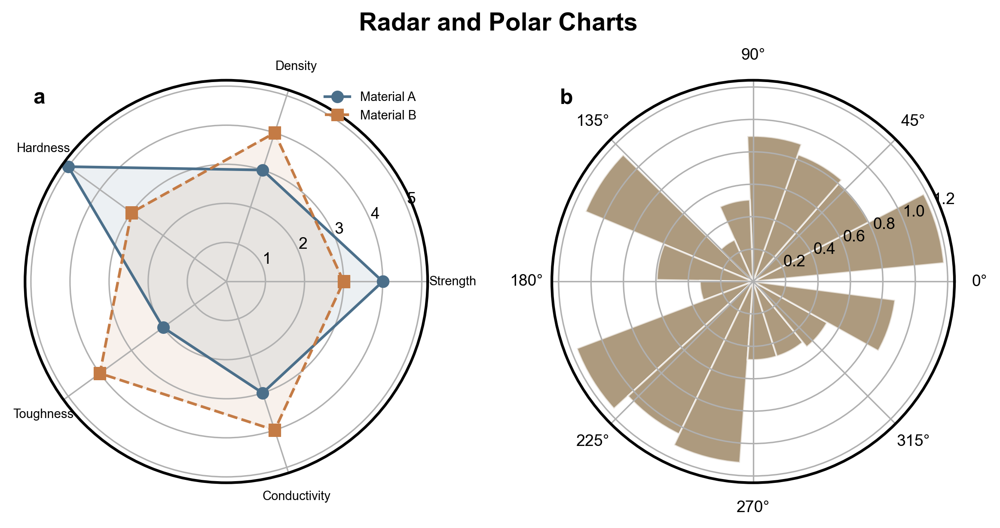 | 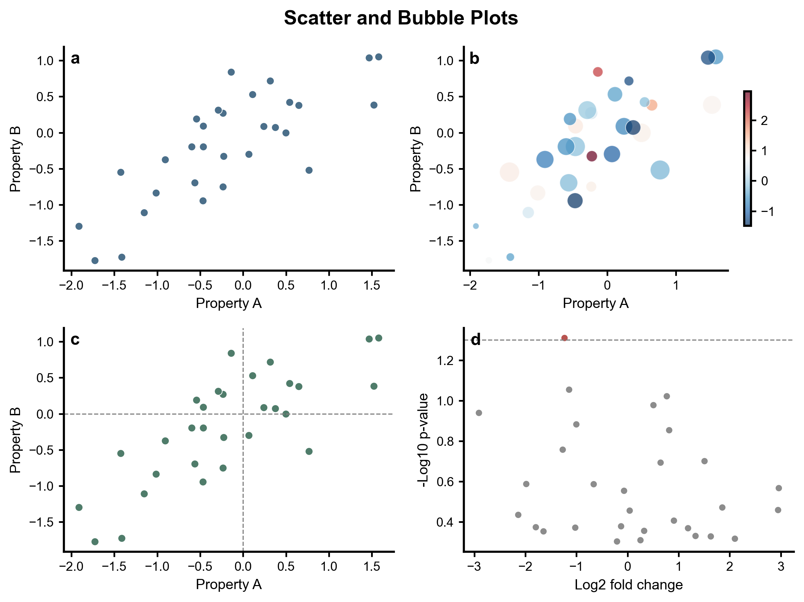 | 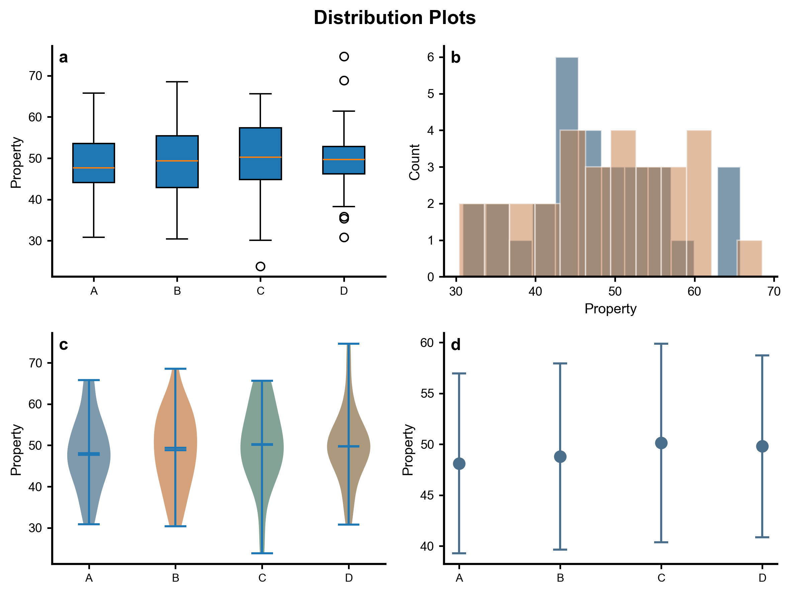 |

**WER-EA atlas** — A 20-panel atlas for waterborne epoxy resin modified
emulsified asphalt research, from screening flow and evidence heatmap to
mechanism map, dosage window, graphical abstract, and research gap. SVG
templates carry the full panel structure, certainty-tier legend, and claim
boundary.

| 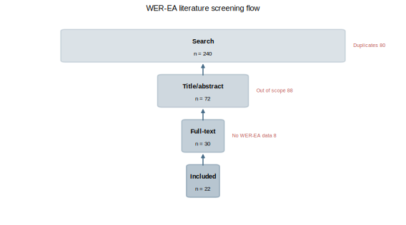 | 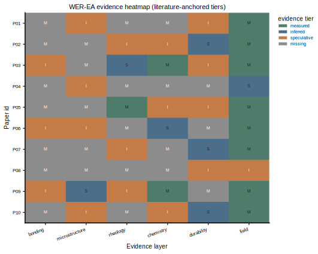 | 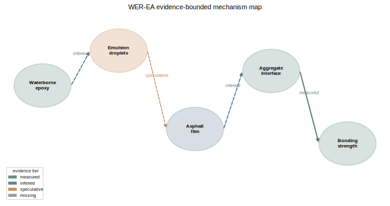 |
|---|---|---|
| 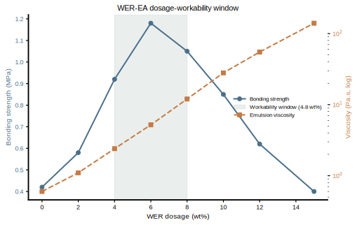 | 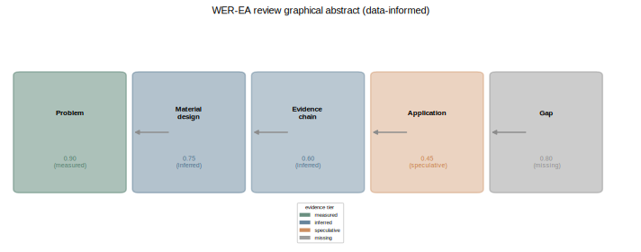 | 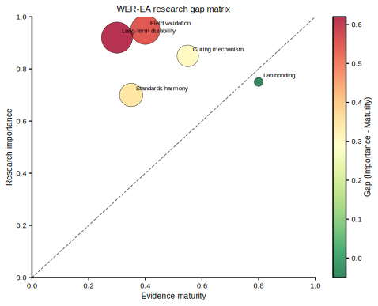 |

**Ceramics atlas** — Characterization figures for structural/functional
ceramics: XRD patterns, stress-strain curves, TGA/DSC, thermal expansion,
Weibull plots, grain-size distributions, EIS Nyquist plots, and sintering
curves.

| 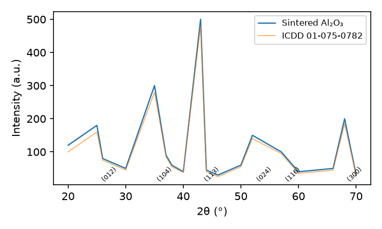 | 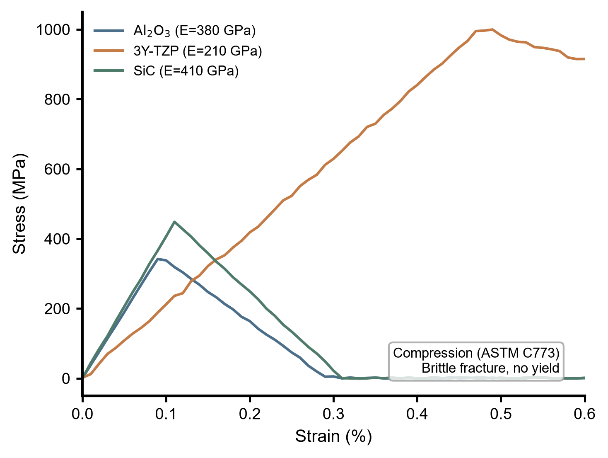 | 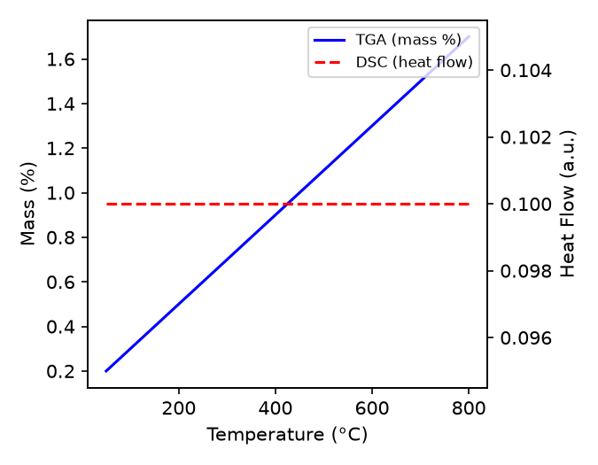 |
|---|---|---|
| 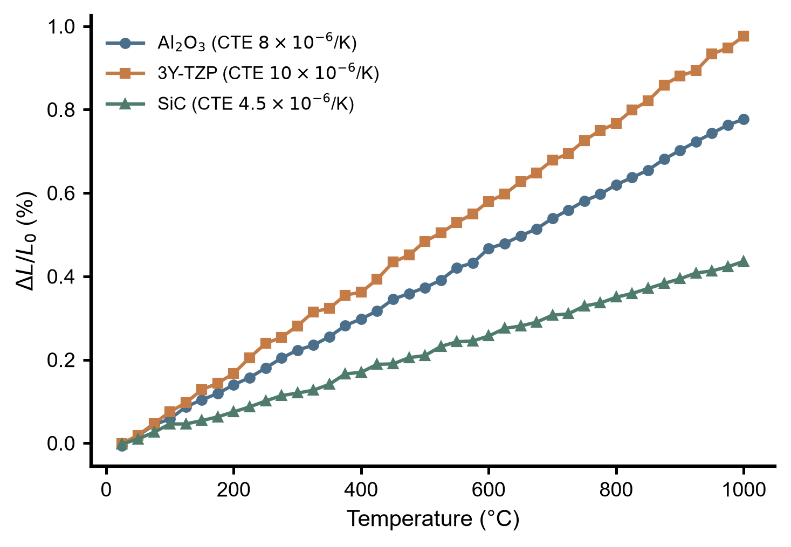 | 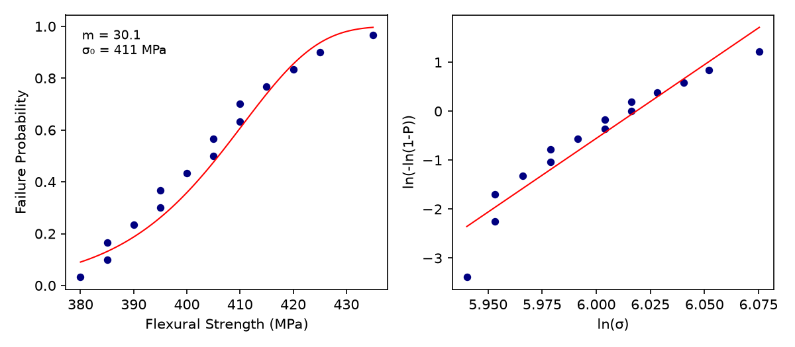 | 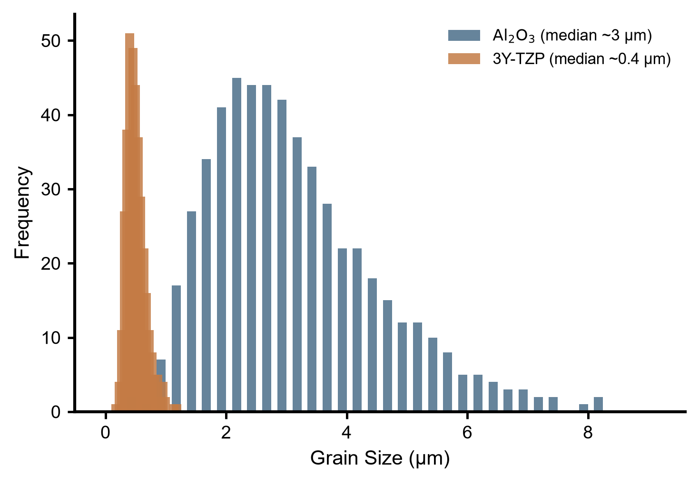 |

**Figure package structure** — Every serious output is delivered as a figure
package, not as a loose image:

```text
figure-package/
  figure_contract.md
  source_data.csv
  plot.py
  figure.svg
  figure.pdf
  figure.png
  figure.tiff
  caption.md
  qa_report.md
  asset_manifest.md
```

**Automatic table-to-figure loop** — When a CSV/TSV data table is available,
use the automatic Python loop before hand-writing a new plot:

```powershell
python plugins/materials-skills/skills/materials-figure/scripts/generate_figure_package.py `
  --data path/to/source_data.csv `
  --output-dir outputs/figure-packages/my-figure `
  --goal "Show the WER dosage trend for bonding strength." `
  --figure-name my_figure `
  --json
```

The loop performs:

```text
data diagnosis -> chart recommendation -> SVG/PNG export -> QA report
```

It writes `figure_intake.yaml`, `source_data.csv`, `plot.py`, `figure.svg`,
`figure.png`, `caption.md`, `qa_report.md`, `asset_manifest.md`, and
`figure_contract.md`. Use the QA report to decide whether the output is ready,
needs revision, or is blocked by missing evidence.

**Key rules enforced**

- Python-only plotting backend; no silent fallback to another stack.
- Figure contract written before plotting: core conclusion, evidence chain,
  panel map, target journal, statistics/units/scale bars, claim boundary.
- Caption boundaries separate measured from inferred claims.
- Export bundle includes SVG, PDF, PNG, and TIFF when possible.
- QA report covers Python backend exclusivity, export checks, and caption
  boundary.
- WER-EA mechanism claims stay bounded by real evidence; the skill does not
  let pretty visuals overrule the scientific logic. If the evidence chain or
  source data anchor is weak, the correct response is to flag the risk or
  route back to reader, citation, writing, or data work before polishing the
  image.

**Runnable figure packages** — Seven example packages with real CSV data and
matplotlib scripts that run standalone. Each demonstrates a different
characterization archetype:

| Package | Archetype | Script |
|---|---|---|
| `examples/figure-packages/ceramics-xrd-phase-identification/` | XRD phase analysis | `plot_xrd.py` |
| `examples/figure-packages/ceramics-sintering-optimization/` | Sintering curve | `plot_sintering.py` |
| `examples/figure-packages/ceramics-weibull-reliability/` | Weibull strength | `plot_weibull.py` |
| `examples/figure-packages/construction-materials-durability/` | Durability retention | `plot.py` |
| `examples/figure-packages/steel-corrosion-trend/` | Corrosion errorbar trend | `plot.py` |
| `examples/figure-packages/sustainability-freeze-thaw/` | Freeze-thaw cycling | `plot.py` |
| `examples/figure-packages/timber-water-absorption/` | Water absorption kinetics | `plot.py` |

Run any package locally:

```powershell
cd plugins/materials-skills/skills/materials-figure/examples/figure-packages/ceramics-xrd-phase-identification
python plot_xrd.py
```

**Reference files**

```text
skills/materials-figure/
├── README.md
├── SKILL.md
├── manifest.yaml
├── scripts/
│   ├── generate_figure_package.py   automatic table-to-figure loop
│   ├── audit_figure_package.py      figure package QA audit
│   ├── materials_plot_lib.py        publication-ready matplotlib helpers
│   ├── materials_plot_svg.py        SVG template renderer
│   └── regenerate_gallery_assets.py regenerate rich-gallery + review-first
├── assets/
│   ├── chart-atlas/                 6 chart families (CSV + SVG/PNG)
│   ├── wer-ea-atlas/                20 WER-EA panels (CSV + SVG)
│   ├── ceramics-atlas/              9 ceramics figures (CSV + SVG/PNG)
│   ├── rich-gallery/                10 general materials figures (SVG/PNG + CSV)
│   ├── review-first/                10 review figures (SVG/PNG + CSV)
│   └── templates/figure-package/    contract, plot.py, caption, QA templates
└── references/
    ├── chart-atlas.md               chart family routing and usage
    ├── figure-package-protocol.md   figure package contract
    ├── figure-production-spec.md    production specification
    ├── figure-qa-contract.md        QA contract
    ├── figure-design-theory.md      typography, layout, export policy
    ├── materials-figure-atlas.md    atlas routing
    ├── wer-ea-figure-atlas.md       WER-EA atlas guide
    └── ceramics-figure-atlas.md     ceramics atlas guide
```

**Supported chart types** — Stacked bar, grouped bar, horizontal ablation bar,
trend/line, sequential heatmap, diverging z-score heatmap, bubble scatter,
radar/polar, 3D sphere illustration, fill-between area, log-scale bar,
GridSpec multi-panel, XRD pattern, stress-strain curve, TGA/DSC overlay,
thermal expansion, Weibull plot, grain-size distribution, EIS Nyquist plot,
sintering curve.

**Validation**

- Audit script:
  `plugins/materials-skills/skills/materials-figure/scripts/audit_figure_package.py`
- Bundle verification:
  `python .\scripts\run_release_checks.py --json`
